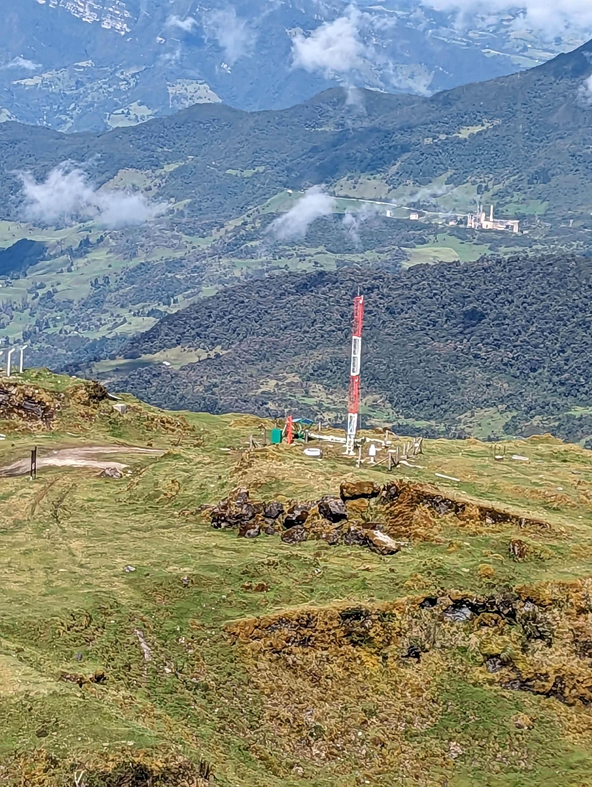
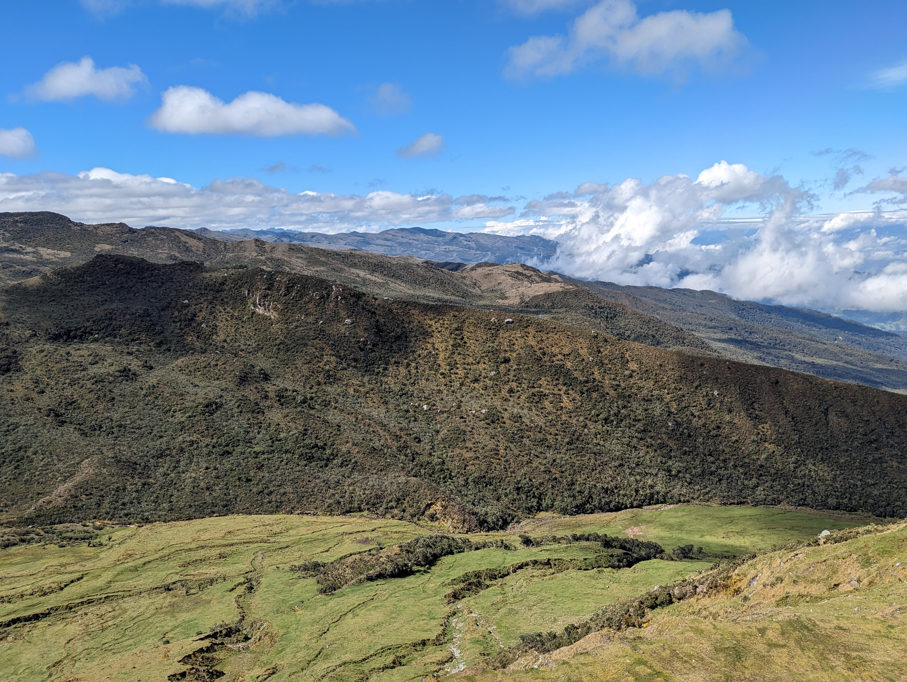
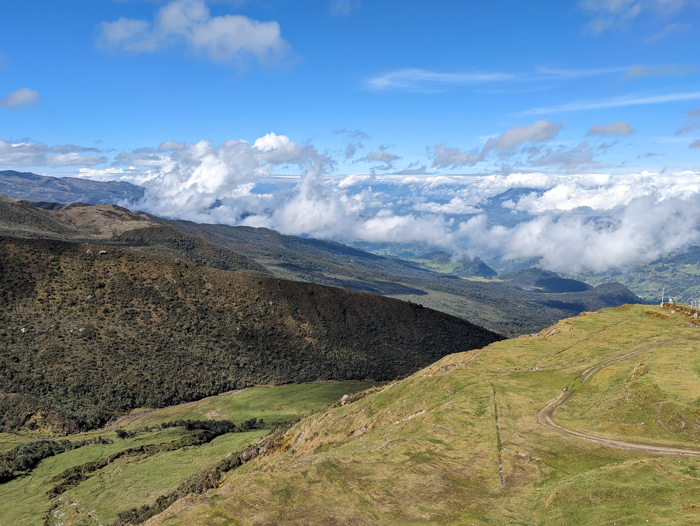
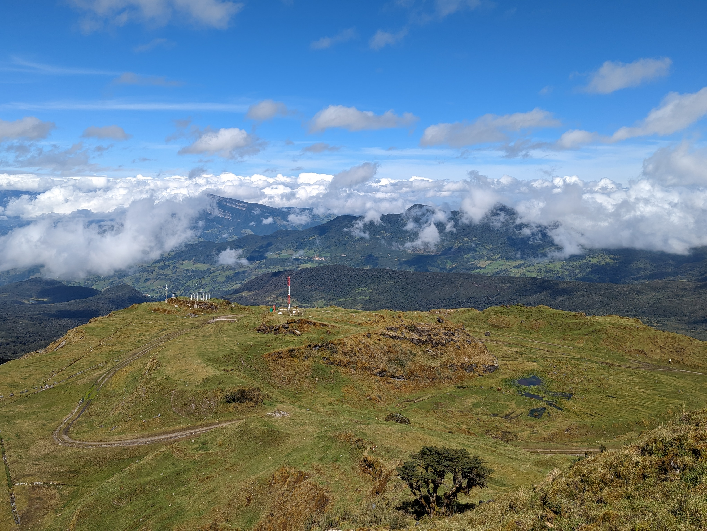
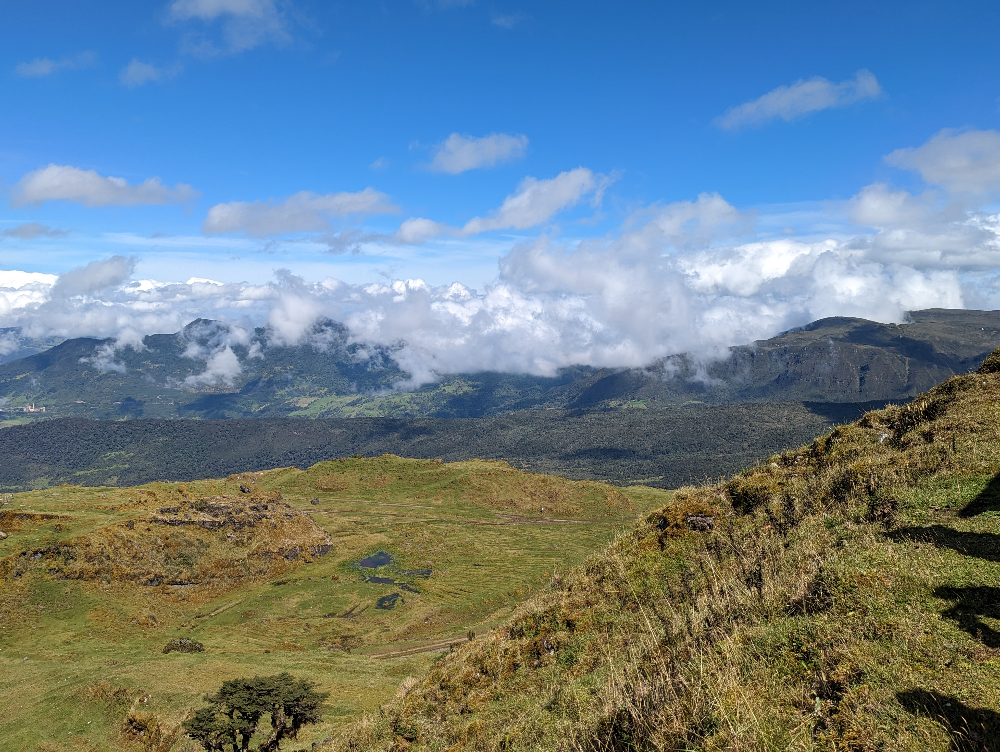

## Antigua mina de caliza CEMEX (2023-05-03)
Créditos: rcfdtools

```geojson
{
  "type": "Feature",
  "geometry": {
    "type": "Point", 
    "coordinates": [-73.8198361111111, 4.712169444444444]
  }, 
  "properties": {
    "Name": "Antigua mina de caliza CEMEX"
  }
}
```

**File: 1/PXL_20230503_141248486.jpg**. OS version: HDR+ 1.0.520435816zd. Date: 2023:05:03 09:12:48
<br>Coordinates & altitude: (4.712488888888889, -73.81947777777778, 3732.0)<br>Location over [Google Maps](http://maps.google.com/maps?q=4.712488888888889,-73.81947777777778) or [Openstreet Map](https://www.openstreetmap.org/query?lat=4.712488888888889&lon=-73.81947777777778)


**File: 1/PXL_20230503_141401490.jpg**. OS version: HDR+ 1.0.520435816zd. Date: 2023:05:03 09:14:01
<br>Coordinates & altitude: (4.712169444444444, -73.8198361111111, 3733.41)<br>Location over [Google Maps](http://maps.google.com/maps?q=4.712169444444444,-73.8198361111111) or [Openstreet Map](https://www.openstreetmap.org/query?lat=4.712169444444444&lon=-73.8198361111111)


**File: 1/PXL_20230503_141404104.jpg**. OS version: HDR+ 1.0.520435816zd. Date: 2023:05:03 09:14:04
<br>Coordinates & altitude: (4.712169444444444, -73.8198361111111, 3733.41)<br>Location over [Google Maps](http://maps.google.com/maps?q=4.712169444444444,-73.8198361111111) or [Openstreet Map](https://www.openstreetmap.org/query?lat=4.712169444444444&lon=-73.8198361111111)


**File: 1/PXL_20230503_141452560.jpg**. OS version: HDR+ 1.0.520435816zd. Date: 2023:05:03 09:14:52
<br>Coordinates & altitude: (4.712169444444444, -73.8198361111111, 3733.41)<br>Location over [Google Maps](http://maps.google.com/maps?q=4.712169444444444,-73.8198361111111) or [Openstreet Map](https://www.openstreetmap.org/query?lat=4.712169444444444&lon=-73.8198361111111)


**File: 1/PXL_20230503_141454219.jpg**. OS version: HDR+ 1.0.520435816zd. Date: 2023:05:03 09:14:54
<br>Coordinates & altitude: (4.712169444444444, -73.8198361111111, 3733.41)<br>Location over [Google Maps](http://maps.google.com/maps?q=4.712169444444444,-73.8198361111111) or [Openstreet Map](https://www.openstreetmap.org/query?lat=4.712169444444444&lon=-73.8198361111111)


**File: 1/PXL_20230503_141456741.jpg**. OS version: HDR+ 1.0.520435816zd. Date: 2023:05:03 09:14:56
<br>Coordinates & altitude: (4.712169444444444, -73.8198361111111, 3733.41)<br>Location over [Google Maps](http://maps.google.com/maps?q=4.712169444444444,-73.8198361111111) or [Openstreet Map](https://www.openstreetmap.org/query?lat=4.712169444444444&lon=-73.8198361111111)


**File: 1/PXL_20230503_141459242.jpg**. OS version: HDR+ 1.0.520435816zd. Date: 2023:05:03 09:14:59
<br>Coordinates & altitude: (4.712169444444444, -73.8198361111111, 3733.41)<br>Location over [Google Maps](http://maps.google.com/maps?q=4.712169444444444,-73.8198361111111) or [Openstreet Map](https://www.openstreetmap.org/query?lat=4.712169444444444&lon=-73.8198361111111)


**File: 1/PXL_20230503_142135200.jpg**. OS version: HDR+ 1.0.520435816zd. Date: 2023:05:03 09:21:35
<br>Coordinates & altitude: (4.712169444444444, -73.81983333333334, 3719.56)<br>Location over [Google Maps](http://maps.google.com/maps?q=4.712169444444444,-73.81983333333334) or [Openstreet Map](https://www.openstreetmap.org/query?lat=4.712169444444444&lon=-73.81983333333334)


**File: 1/PXL_20230503_142138155.jpg**. OS version: HDR+ 1.0.520435816zd. Date: 2023:05:03 09:21:38
<br>Coordinates & altitude: (4.712169444444444, -73.81983333333334, 3719.56)<br>Location over [Google Maps](http://maps.google.com/maps?q=4.712169444444444,-73.81983333333334) or [Openstreet Map](https://www.openstreetmap.org/query?lat=4.712169444444444&lon=-73.81983333333334)


**File: 1/PXL_20230503_142141424.jpg**. OS version: HDR+ 1.0.520435816zd. Date: 2023:05:03 09:21:41
<br>Coordinates & altitude: (4.712169444444444, -73.81983333333334, 3719.56)<br>Location over [Google Maps](http://maps.google.com/maps?q=4.712169444444444,-73.81983333333334) or [Openstreet Map](https://www.openstreetmap.org/query?lat=4.712169444444444&lon=-73.81983333333334)


