## Arroyo San Antonio - Erosión remontante (2013-07-03)
Créditos: rcfdtools<br>Categoría: Technical field visit

```geojson
{
  "type": "Feature",
  "geometry": {
    "type": "Point", 
    "coordinates": [-73.4627698, 9.5332223]
  }, 
  "properties": {
    "Name": "Arroyo San Antonio - Erosión remontante"
  }
}
```

**File: 10/2013-07-03_16.02.18.jpg**. OS version: N7000XXLS2. Date: 2013:07:03 16:02:18
<br>Coordinates & altitude: (9.5336385, -73.4629137, 56.84)<br>Location over [Google Maps](http://maps.google.com/maps?q=9.5336385,-73.4629137) or [Openstreet Map](https://www.openstreetmap.org/query?lat=9.5336385&lon=-73.4629137)
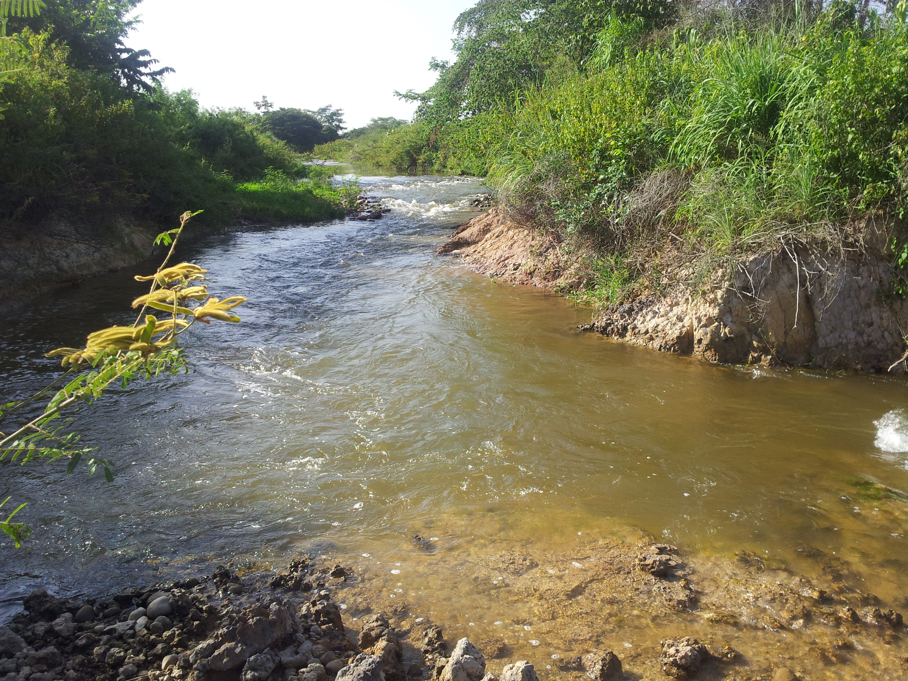

**File: 10/2013-07-03_16.02.21.jpg**. OS version: N7000XXLS2. Date: 2013:07:03 16:02:21
<br>Coordinates & altitude: (9.5336385, -73.4629137, 56.84)<br>Location over [Google Maps](http://maps.google.com/maps?q=9.5336385,-73.4629137) or [Openstreet Map](https://www.openstreetmap.org/query?lat=9.5336385&lon=-73.4629137)
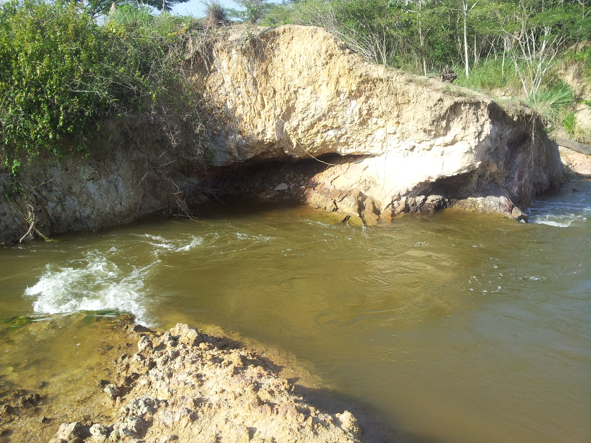

**File: 10/2013-07-03_16.02.26.jpg**. OS version: N7000XXLS2. Date: 2013:07:03 16:02:26
<br>Coordinates & altitude: (9.5336385, -73.4629137, 56.84)<br>Location over [Google Maps](http://maps.google.com/maps?q=9.5336385,-73.4629137) or [Openstreet Map](https://www.openstreetmap.org/query?lat=9.5336385&lon=-73.4629137)
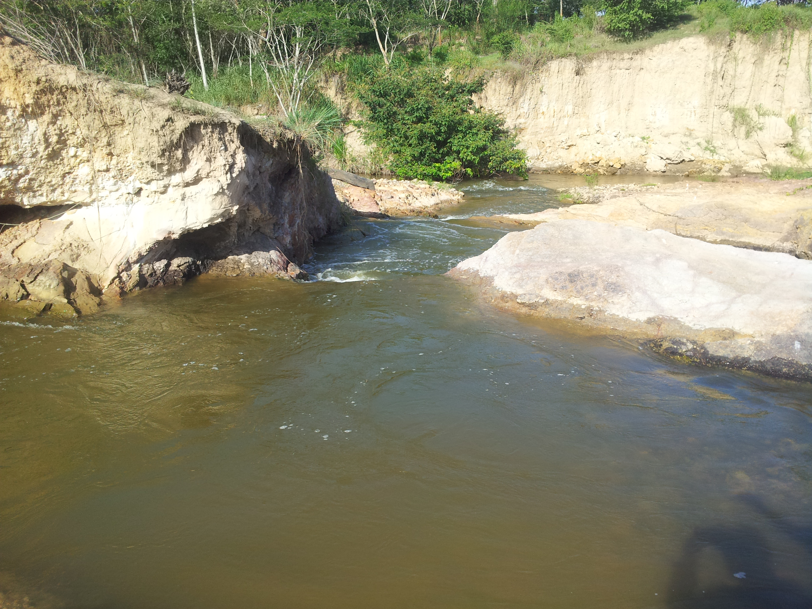

**File: 10/2013-07-03_16.02.34.jpg**. OS version: N7000XXLS2. Date: 2013:07:03 16:02:34
<br>Coordinates & altitude: (9.5336385, -73.4629137, 56.84)<br>Location over [Google Maps](http://maps.google.com/maps?q=9.5336385,-73.4629137) or [Openstreet Map](https://www.openstreetmap.org/query?lat=9.5336385&lon=-73.4629137)
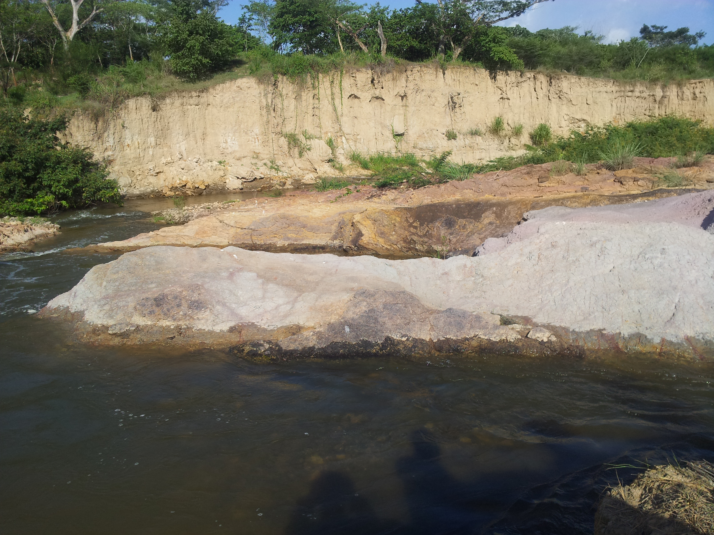

**File: 10/2013-07-03_16.02.37.jpg**. OS version: N7000XXLS2. Date: 2013:07:03 16:02:37
<br>Coordinates & altitude: (9.5336385, -73.4629137, 56.84)<br>Location over [Google Maps](http://maps.google.com/maps?q=9.5336385,-73.4629137) or [Openstreet Map](https://www.openstreetmap.org/query?lat=9.5336385&lon=-73.4629137)
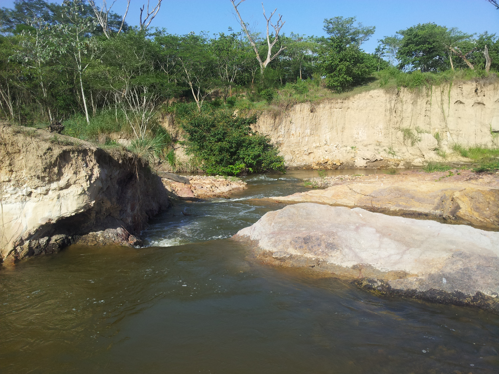

**File: 10/2013-07-03_16.02.53.jpg**. OS version: N7000XXLS2. Date: 2013:07:03 16:02:53
<br>Coordinates & altitude: (9.5336385, -73.4629137, 56.84)<br>Location over [Google Maps](http://maps.google.com/maps?q=9.5336385,-73.4629137) or [Openstreet Map](https://www.openstreetmap.org/query?lat=9.5336385&lon=-73.4629137)
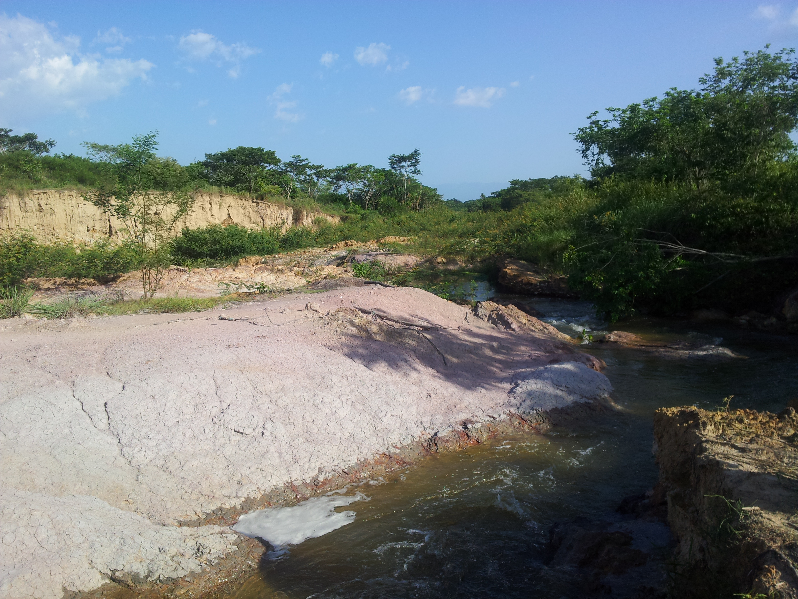

**File: 10/2013-07-03_16.03.00.jpg**. OS version: N7000XXLS2. Date: 2013:07:03 16:03:00
<br>Coordinates & altitude: (9.5336385, -73.4629137, 56.84)<br>Location over [Google Maps](http://maps.google.com/maps?q=9.5336385,-73.4629137) or [Openstreet Map](https://www.openstreetmap.org/query?lat=9.5336385&lon=-73.4629137)
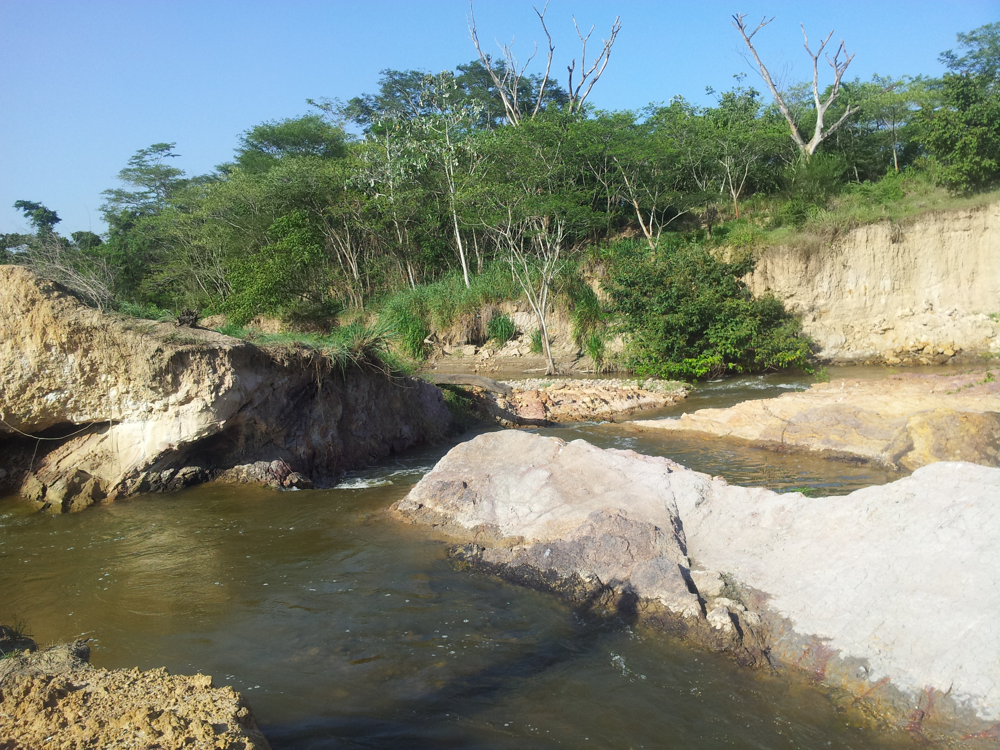

**File: 10/2013-07-03_16.10.23.jpg**. OS version: N7000XXLS2. Date: 2013:07:03 16:10:23
<br>Coordinates & altitude: (9.5332223, -73.4627698, 57.73)<br>Location over [Google Maps](http://maps.google.com/maps?q=9.5332223,-73.4627698) or [Openstreet Map](https://www.openstreetmap.org/query?lat=9.5332223&lon=-73.4627698)
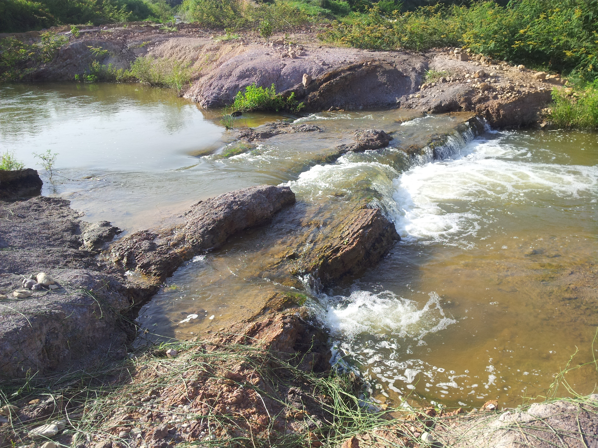

**File: 10/2013-07-03_16.10.26.jpg**. OS version: N7000XXLS2. Date: 2013:07:03 16:10:26
<br>Coordinates & altitude: (9.5332223, -73.4627698, 57.73)<br>Location over [Google Maps](http://maps.google.com/maps?q=9.5332223,-73.4627698) or [Openstreet Map](https://www.openstreetmap.org/query?lat=9.5332223&lon=-73.4627698)
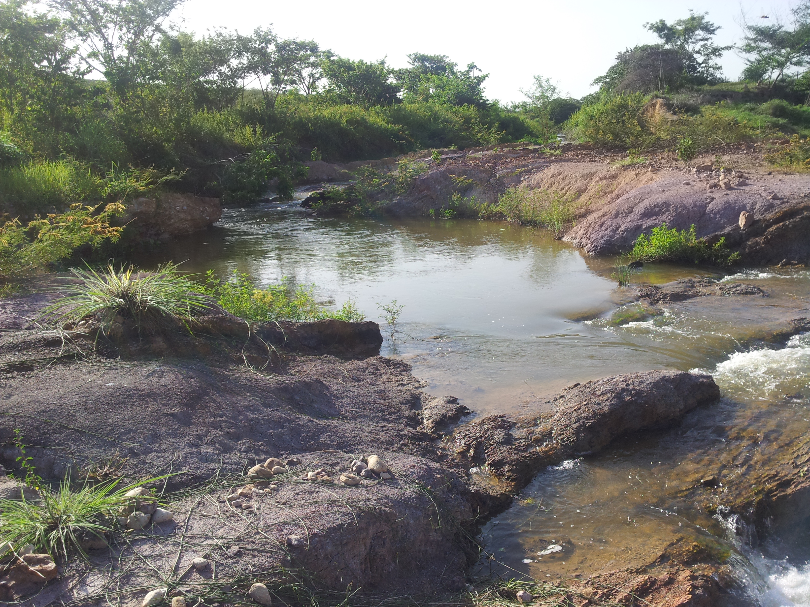

**File: 10/2013-07-03_16.10.30.jpg**. OS version: N7000XXLS2. Date: 2013:07:03 16:10:30
<br>Coordinates & altitude: (9.5332223, -73.4627698, 57.73)<br>Location over [Google Maps](http://maps.google.com/maps?q=9.5332223,-73.4627698) or [Openstreet Map](https://www.openstreetmap.org/query?lat=9.5332223&lon=-73.4627698)
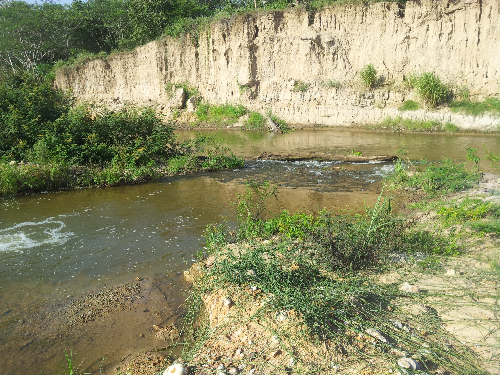

**File: 10/2013-07-03_16.10.52.jpg**. OS version: N7000XXLS2. Date: 2013:07:03 16:10:52
<br>Coordinates & altitude: (9.5332223, -73.4627698, 57.73)<br>Location over [Google Maps](http://maps.google.com/maps?q=9.5332223,-73.4627698) or [Openstreet Map](https://www.openstreetmap.org/query?lat=9.5332223&lon=-73.4627698)
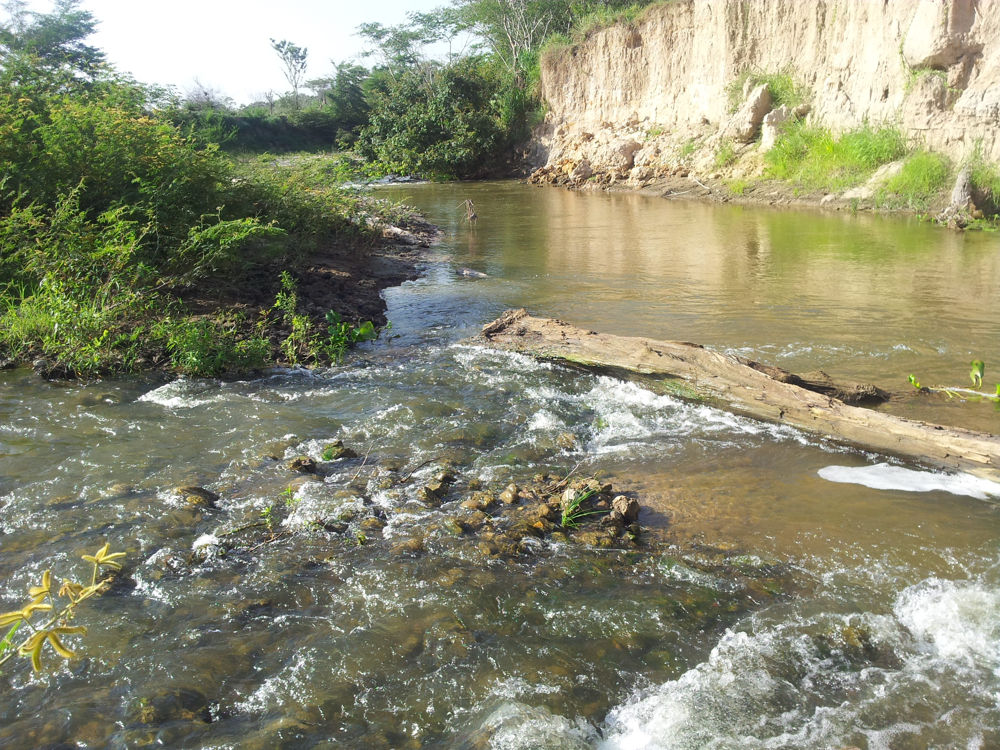

**File: 10/2013-07-03_16.11.05.jpg**. OS version: N7000XXLS2. Date: 2013:07:03 16:11:05
<br>Coordinates & altitude: (9.5332223, -73.4627698, 57.73)<br>Location over [Google Maps](http://maps.google.com/maps?q=9.5332223,-73.4627698) or [Openstreet Map](https://www.openstreetmap.org/query?lat=9.5332223&lon=-73.4627698)
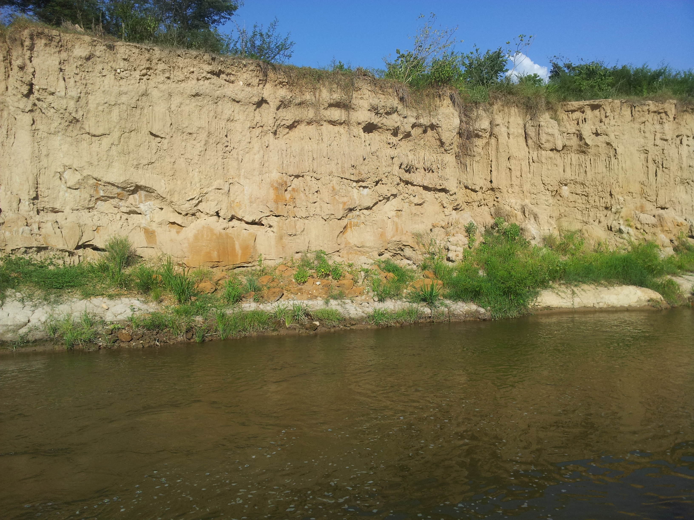

**File: 10/2013-07-03_16.11.59.jpg**. OS version: N7000XXLS2. Date: 2013:07:03 16:11:59
<br>Coordinates & altitude: (9.5332223, -73.4627698, 57.73)<br>Location over [Google Maps](http://maps.google.com/maps?q=9.5332223,-73.4627698) or [Openstreet Map](https://www.openstreetmap.org/query?lat=9.5332223&lon=-73.4627698)
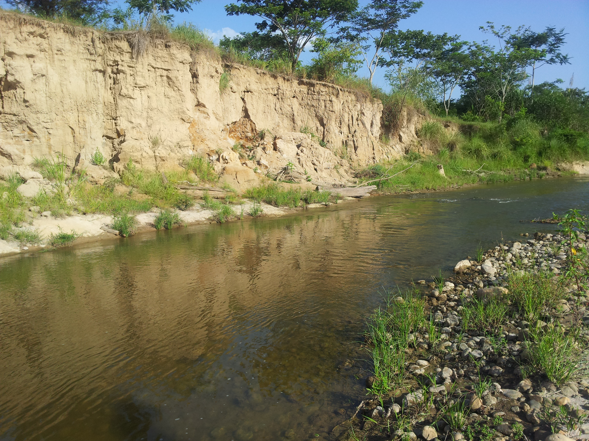

**File: 10/2013-07-03_16.14.39.jpg**. OS version: N7000XXLS2. Date: 2013:07:03 16:14:39
<br>Coordinates & altitude: (9.5330167, -73.4626651, 56.05)<br>Location over [Google Maps](http://maps.google.com/maps?q=9.5330167,-73.4626651) or [Openstreet Map](https://www.openstreetmap.org/query?lat=9.5330167&lon=-73.4626651)
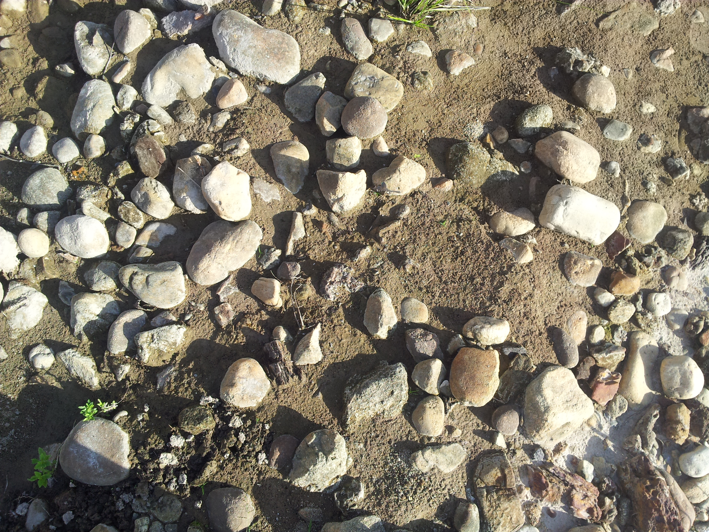

**File: 10/2013-07-03_16.26.22.jpg**. OS version: N7000XXLS2. Date: 2013:07:03 16:26:22
<br>Coordinates & altitude: (9.5282362, -73.4623197, 54.04)<br>Location over [Google Maps](http://maps.google.com/maps?q=9.5282362,-73.4623197) or [Openstreet Map](https://www.openstreetmap.org/query?lat=9.5282362&lon=-73.4623197)
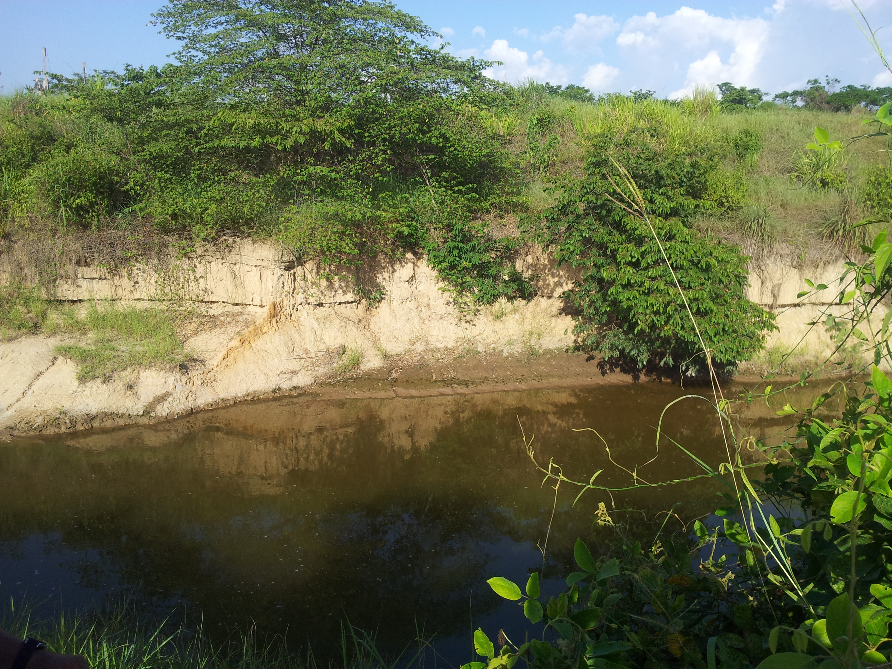

**File: 10/2013-07-03_16.26.26.jpg**. OS version: N7000XXLS2. Date: 2013:07:03 16:26:26
<br>Coordinates & altitude: (9.5282362, -73.4623197, 54.04)<br>Location over [Google Maps](http://maps.google.com/maps?q=9.5282362,-73.4623197) or [Openstreet Map](https://www.openstreetmap.org/query?lat=9.5282362&lon=-73.4623197)
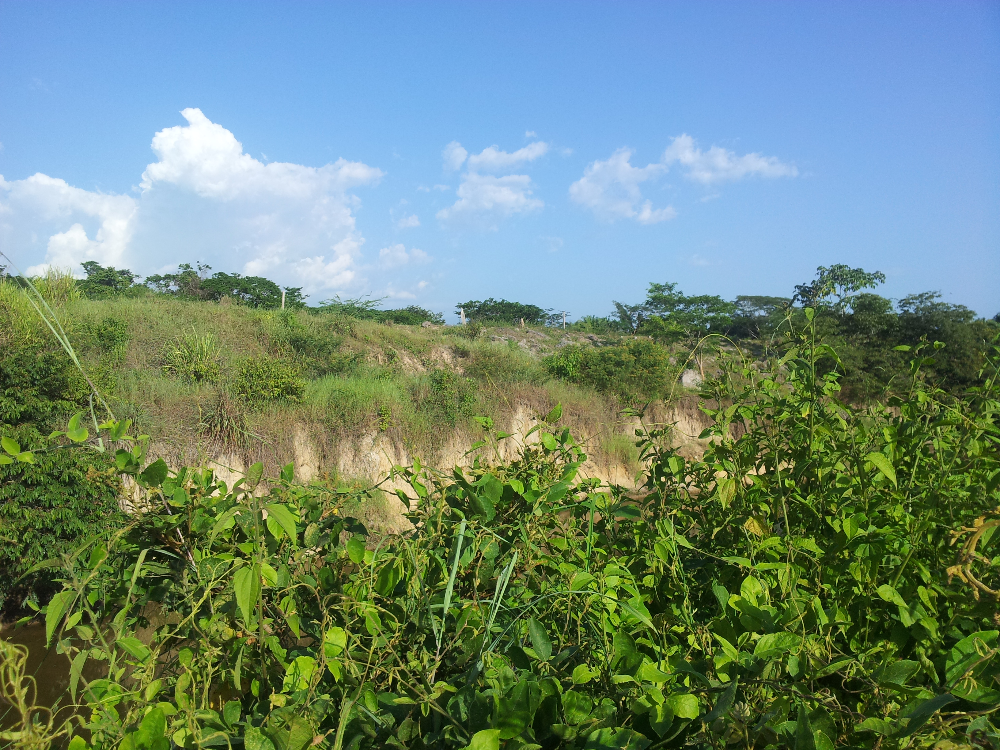

**File: 10/2013-07-03_16.28.03.jpg**. OS version: N7000XXLS2. Date: 2013:07:03 16:28:03
<br>Coordinates & altitude: (9.5282168, -73.4622893, 52.94)<br>Location over [Google Maps](http://maps.google.com/maps?q=9.5282168,-73.4622893) or [Openstreet Map](https://www.openstreetmap.org/query?lat=9.5282168&lon=-73.4622893)
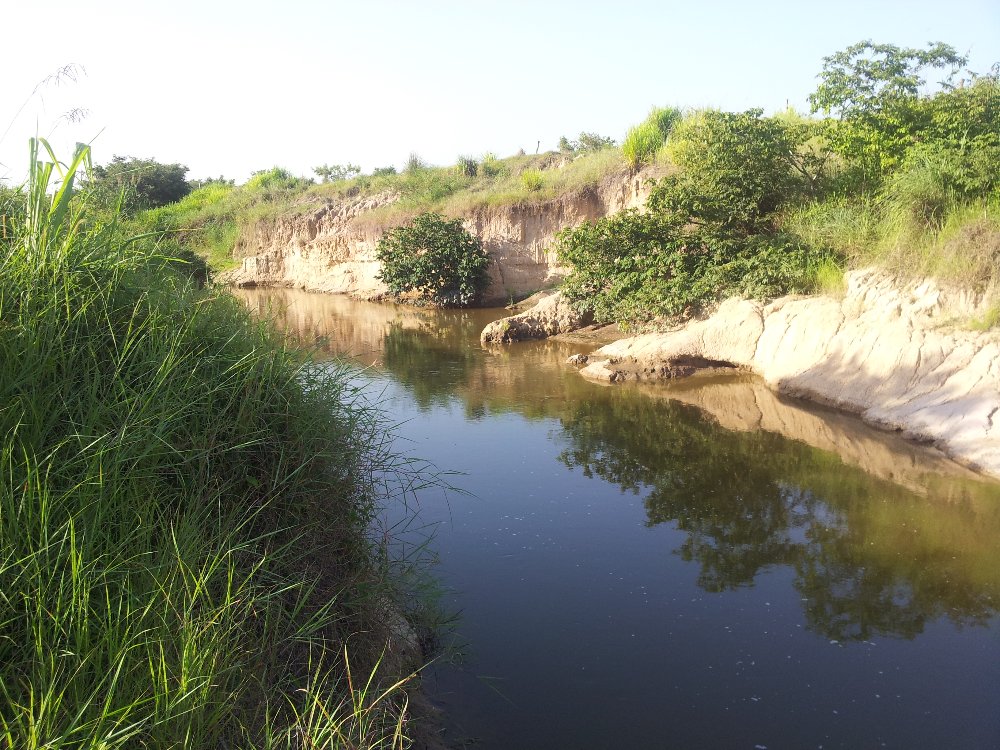

**File: 10/2013-07-03_16.28.07.jpg**. OS version: N7000XXLS2. Date: 2013:07:03 16:28:07
<br>Coordinates & altitude: (9.5282168, -73.4622893, 52.94)<br>Location over [Google Maps](http://maps.google.com/maps?q=9.5282168,-73.4622893) or [Openstreet Map](https://www.openstreetmap.org/query?lat=9.5282168&lon=-73.4622893)
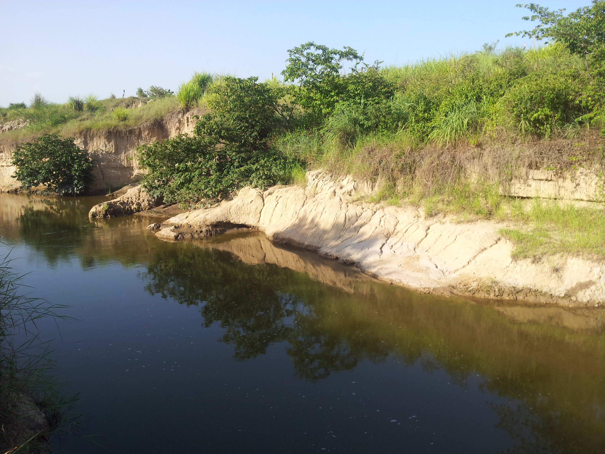

**File: 10/2013-07-03_16.29.54.jpg**. OS version: N7000XXLS2. Date: 2013:07:03 16:29:54
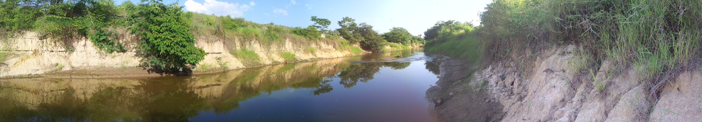

**File: 10/2013-07-03_16.30.54.jpg**. OS version: N7000XXLS2. Date: 2013:07:03 16:30:54
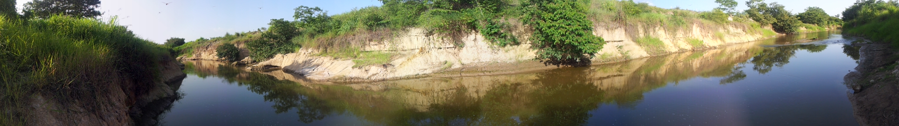

**File: 10/2013-07-03_16.39.14.jpg**. OS version: N7000XXLS2. Date: 2013:07:03 16:39:14
<br>Coordinates & altitude: (9.5249731, -73.4694264, 46.07)<br>Location over [Google Maps](http://maps.google.com/maps?q=9.5249731,-73.4694264) or [Openstreet Map](https://www.openstreetmap.org/query?lat=9.5249731&lon=-73.4694264)
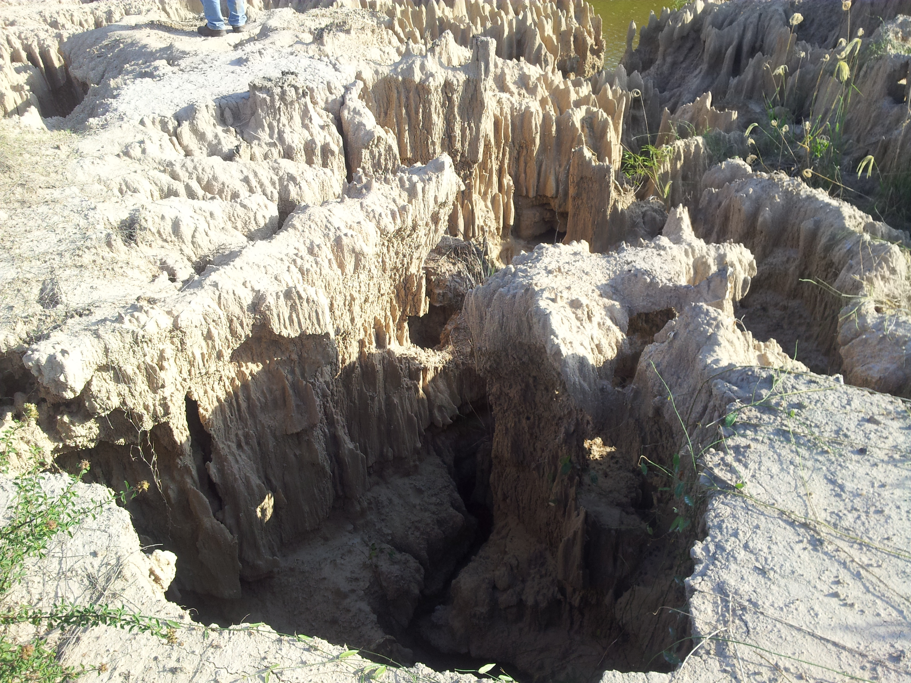

**File: 10/2013-07-03_16.39.21.jpg**. OS version: N7000XXLS2. Date: 2013:07:03 16:39:21
<br>Coordinates & altitude: (9.5249731, -73.4694264, 46.07)<br>Location over [Google Maps](http://maps.google.com/maps?q=9.5249731,-73.4694264) or [Openstreet Map](https://www.openstreetmap.org/query?lat=9.5249731&lon=-73.4694264)
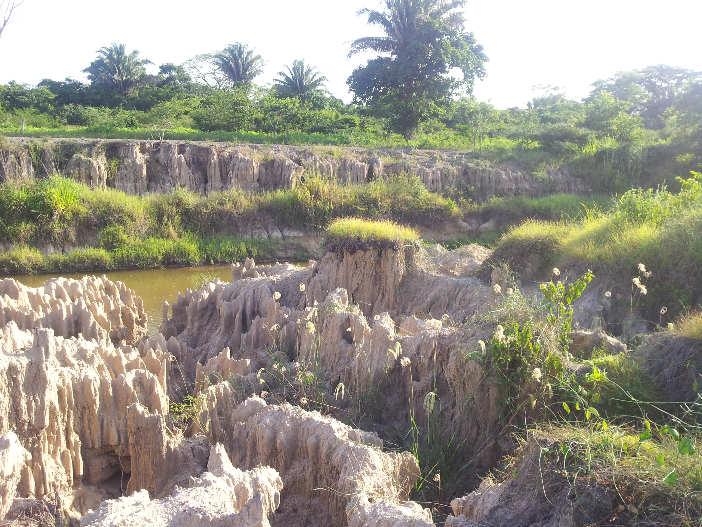

**File: 10/2013-07-03_16.39.31.jpg**. OS version: N7000XXLS2. Date: 2013:07:03 16:39:31
<br>Coordinates & altitude: (9.5249731, -73.4694264, 46.07)<br>Location over [Google Maps](http://maps.google.com/maps?q=9.5249731,-73.4694264) or [Openstreet Map](https://www.openstreetmap.org/query?lat=9.5249731&lon=-73.4694264)
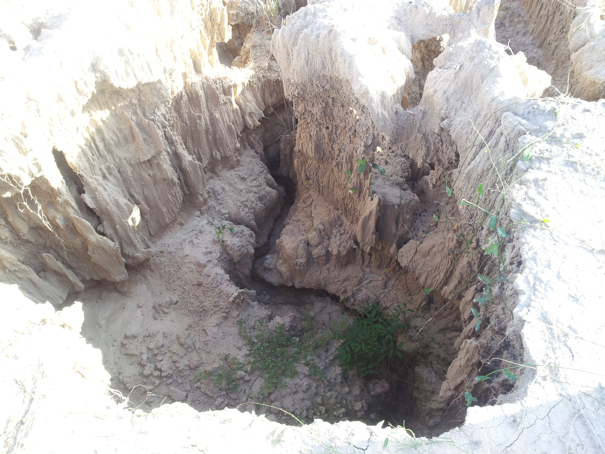

| [:house: Inicio](../Readme.md) |
|---|