## Arroyo San Antonio - Paso de vía en entrega Realineamiento #4 (2013-07-03)
Créditos: rcfdtools<br>Categoría: Technical field visit

```geojson
{
  "type": "Feature",
  "geometry": {
    "type": "Point", 
    "coordinates": [-73.5215662, 9.5384802]
  }, 
  "properties": {
    "Name": "Arroyo San Antonio - Paso de vía en entrega Realineamiento #4"
  }
}
```

**File: 11/2013-07-04_08.54.52.jpg**. OS version: N7000XXLS2. Date: 2013:07:04 08:54:52
<br>Coordinates & altitude: (9.5384802, -73.5215662, 39.24)<br>Location over [Google Maps](http://maps.google.com/maps?q=9.5384802,-73.5215662) or [Openstreet Map](https://www.openstreetmap.org/query?lat=9.5384802&lon=-73.5215662)
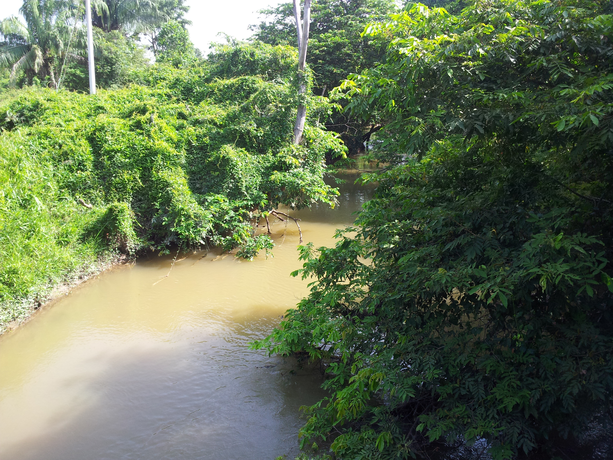

**File: 11/2013-07-04_08.55.15.jpg**. OS version: N7000XXLS2. Date: 2013:07:04 08:55:15
<br>Coordinates & altitude: (9.5384802, -73.5215662, 39.24)<br>Location over [Google Maps](http://maps.google.com/maps?q=9.5384802,-73.5215662) or [Openstreet Map](https://www.openstreetmap.org/query?lat=9.5384802&lon=-73.5215662)
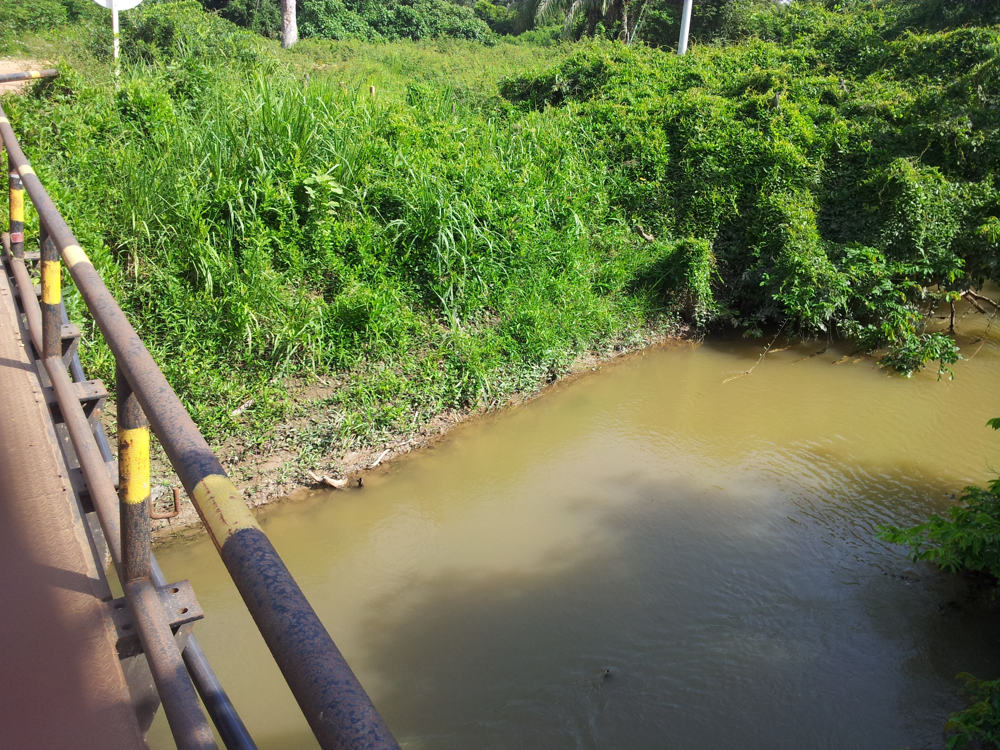

**File: 11/2013-07-04_08.58.04.jpg**. OS version: N7000XXLS2. Date: 2013:07:04 08:58:04
<br>Coordinates & altitude: (9.5384264, -73.5215579, 40.13)<br>Location over [Google Maps](http://maps.google.com/maps?q=9.5384264,-73.5215579) or [Openstreet Map](https://www.openstreetmap.org/query?lat=9.5384264&lon=-73.5215579)
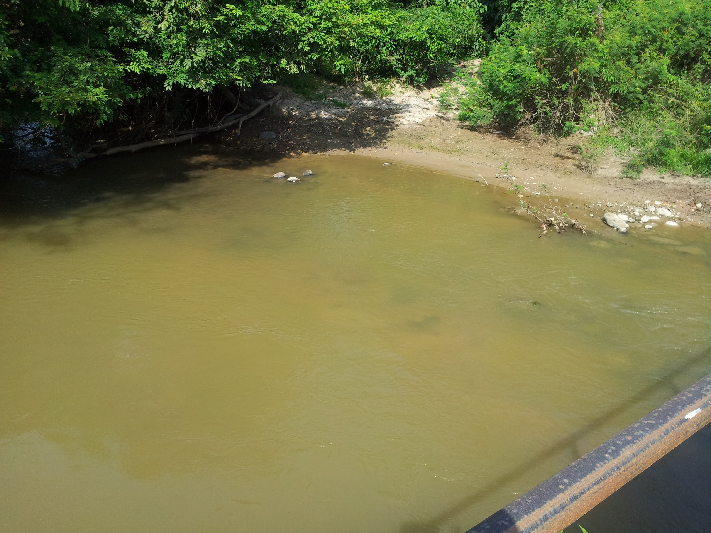

**File: 11/2013-07-04_08.58.24.jpg**. OS version: N7000XXLS2. Date: 2013:07:04 08:58:24
<br>Coordinates & altitude: (9.5384264, -73.5215579, 40.13)<br>Location over [Google Maps](http://maps.google.com/maps?q=9.5384264,-73.5215579) or [Openstreet Map](https://www.openstreetmap.org/query?lat=9.5384264&lon=-73.5215579)
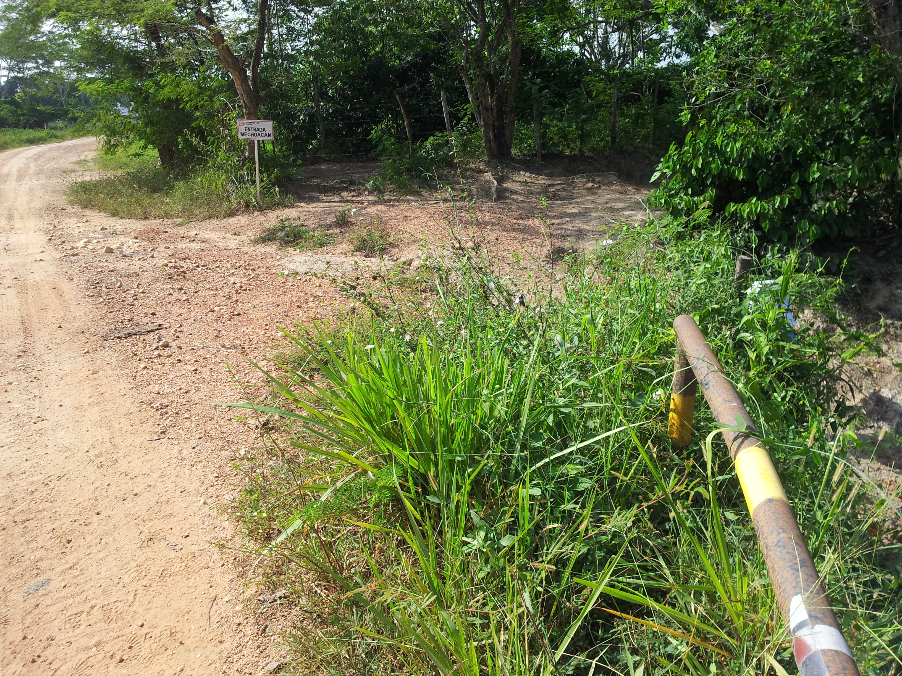

**File: 11/2013-07-04_08.58.43.jpg**. OS version: N7000XXLS2. Date: 2013:07:04 08:58:43
<br>Coordinates & altitude: (9.5384264, -73.5215579, 40.13)<br>Location over [Google Maps](http://maps.google.com/maps?q=9.5384264,-73.5215579) or [Openstreet Map](https://www.openstreetmap.org/query?lat=9.5384264&lon=-73.5215579)
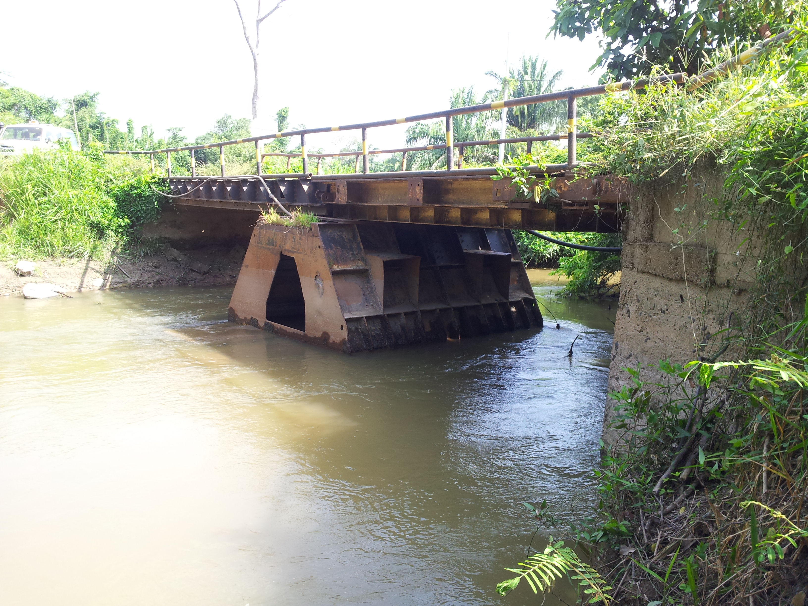

**File: 11/2013-07-04_08.58.48.jpg**. OS version: N7000XXLS2. Date: 2013:07:04 08:58:48
<br>Coordinates & altitude: (9.5384264, -73.5215579, 40.13)<br>Location over [Google Maps](http://maps.google.com/maps?q=9.5384264,-73.5215579) or [Openstreet Map](https://www.openstreetmap.org/query?lat=9.5384264&lon=-73.5215579)
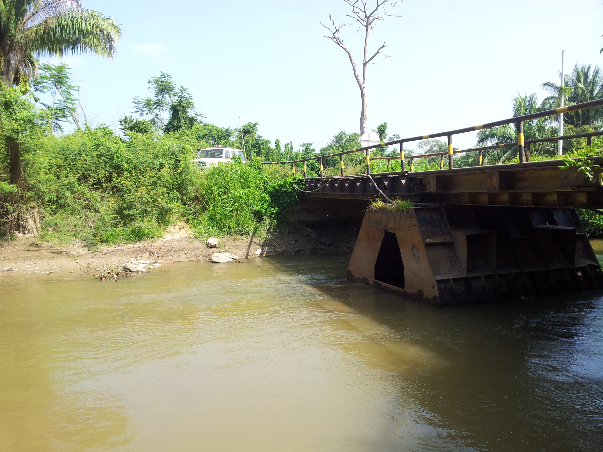

**File: 11/2013-07-04_08.58.52.jpg**. OS version: N7000XXLS2. Date: 2013:07:04 08:58:52
<br>Coordinates & altitude: (9.5384264, -73.5215579, 40.13)<br>Location over [Google Maps](http://maps.google.com/maps?q=9.5384264,-73.5215579) or [Openstreet Map](https://www.openstreetmap.org/query?lat=9.5384264&lon=-73.5215579)
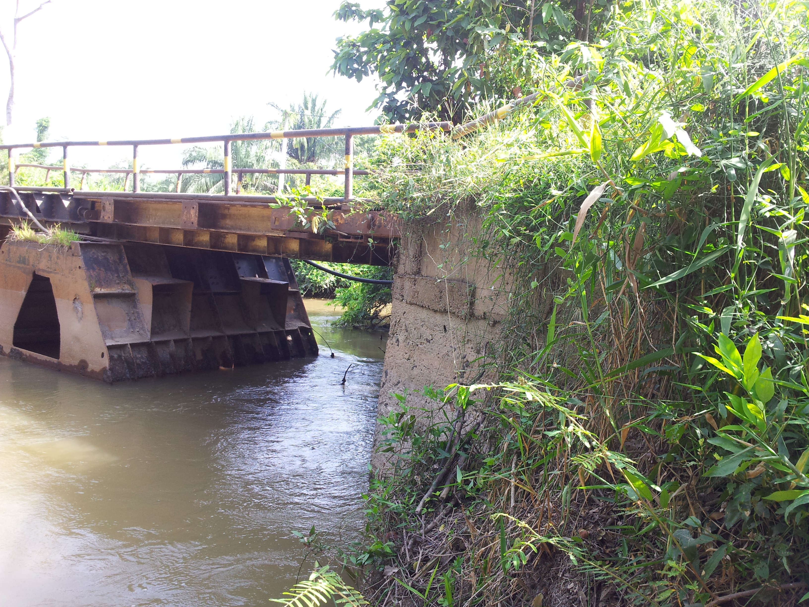

**File: 11/2013-07-04_08.59.56.jpg**. OS version: N7000XXLS2. Date: 2013:07:04 08:59:56
<br>Coordinates & altitude: (9.5384264, -73.5215579, 40.13)<br>Location over [Google Maps](http://maps.google.com/maps?q=9.5384264,-73.5215579) or [Openstreet Map](https://www.openstreetmap.org/query?lat=9.5384264&lon=-73.5215579)
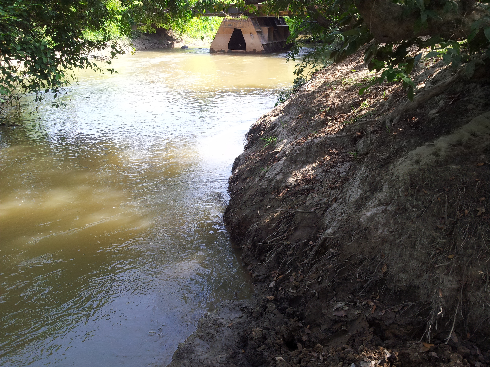

**File: 11/2013-07-04_09.00.00.jpg**. OS version: N7000XXLS2. Date: 2013:07:04 09:00:00
<br>Coordinates & altitude: (9.5381873, -73.5215483, 77.59)<br>Location over [Google Maps](http://maps.google.com/maps?q=9.5381873,-73.5215483) or [Openstreet Map](https://www.openstreetmap.org/query?lat=9.5381873&lon=-73.5215483)


**File: 11/2013-07-04_09.00.06.jpg**. OS version: N7000XXLS2. Date: 2013:07:04 09:00:06
<br>Coordinates & altitude: (9.5381873, -73.5215483, 77.59)<br>Location over [Google Maps](http://maps.google.com/maps?q=9.5381873,-73.5215483) or [Openstreet Map](https://www.openstreetmap.org/query?lat=9.5381873&lon=-73.5215483)
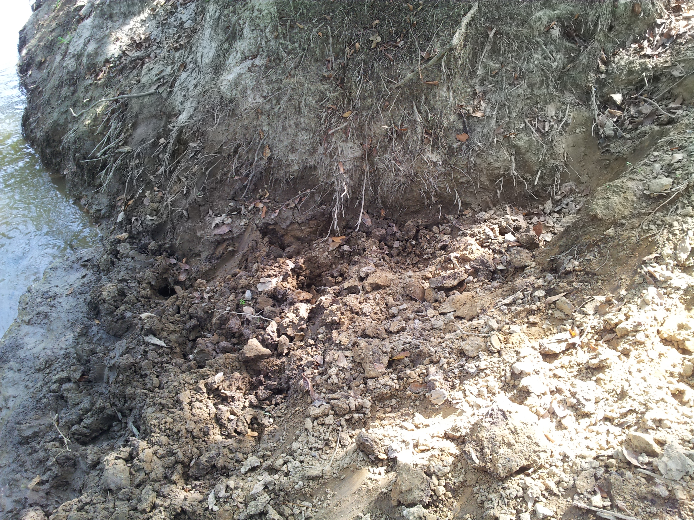

**File: 11/2013-07-04_09.00.11.jpg**. OS version: N7000XXLS2. Date: 2013:07:04 09:00:11
<br>Coordinates & altitude: (9.5381873, -73.5215483, 77.59)<br>Location over [Google Maps](http://maps.google.com/maps?q=9.5381873,-73.5215483) or [Openstreet Map](https://www.openstreetmap.org/query?lat=9.5381873&lon=-73.5215483)
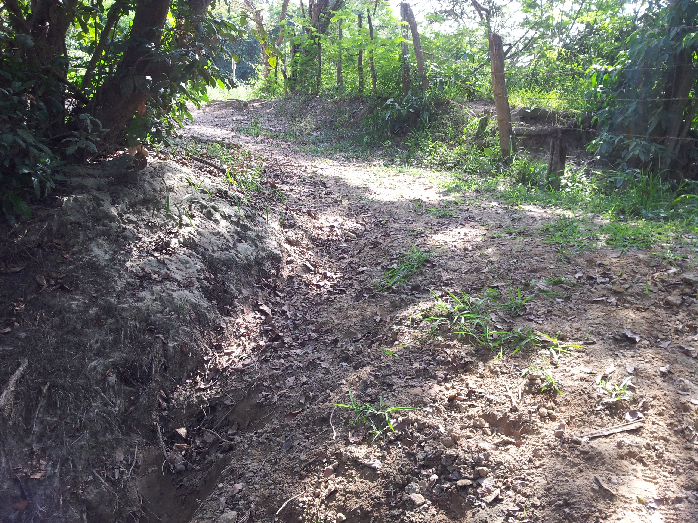

**File: 11/2013-07-04_09.00.17.jpg**. OS version: N7000XXLS2. Date: 2013:07:04 09:00:17
<br>Coordinates & altitude: (9.5381873, -73.5215483, 77.59)<br>Location over [Google Maps](http://maps.google.com/maps?q=9.5381873,-73.5215483) or [Openstreet Map](https://www.openstreetmap.org/query?lat=9.5381873&lon=-73.5215483)
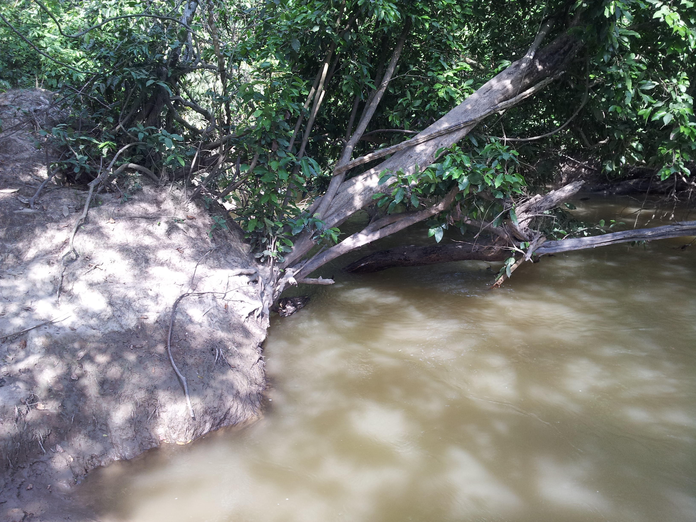

| [:house: Inicio](../Readme.md) |
|---|