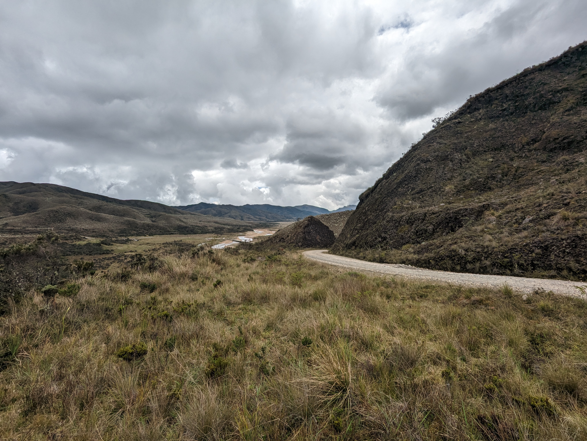

## Localización futura presa Río La Playa - Guatiquía (2023-05-03)
Créditos: rcfdtools

File: 5/PXL_20230503_174747256.jpg. OS version: HDR+ 1.0.520435816zd. Date: 2023:05:03 12:47:47
 Coordinates & altitude: (4.5409, -73.75708888888889, 3220.78)
Location over [Google Maps](http://maps.google.com/maps?q=-73.75708888888889,4.5409) or [Openstreet Map](https://www.openstreetmap.org/query?lat=-73.75708888888889&lon=4.5409)

File: 5/PXL_20230503_174751371.jpg. OS version: HDR+ 1.0.520435816zd. Date: 2023:05:03 12:47:51
 Coordinates & altitude: (4.5409, -73.75708888888889, 3220.78)
Location over [Google Maps](http://maps.google.com/maps?q=-73.75708888888889,4.5409) or [Openstreet Map](https://www.openstreetmap.org/query?lat=-73.75708888888889&lon=4.5409)

File: 5/PXL_20230503_174827257.jpg. OS version: HDR+ 1.0.520435816zd. Date: 2023:05:03 12:48:27
 Coordinates & altitude: (4.540480555555556, -73.75746388888889, 3224.2)
Location over [Google Maps](http://maps.google.com/maps?q=-73.75746388888889,4.540480555555556) or [Openstreet Map](https://www.openstreetmap.org/query?lat=-73.75746388888889&lon=4.540480555555556)

File: 5/PXL_20230503_174837491.jpg. OS version: HDR+ 1.0.520435816zd. Date: 2023:05:03 12:48:37
 Coordinates & altitude: (4.540480555555556, -73.75746388888889, 3224.2)
Location over [Google Maps](http://maps.google.com/maps?q=-73.75746388888889,4.540480555555556) or [Openstreet Map](https://www.openstreetmap.org/query?lat=-73.75746388888889&lon=4.540480555555556)

