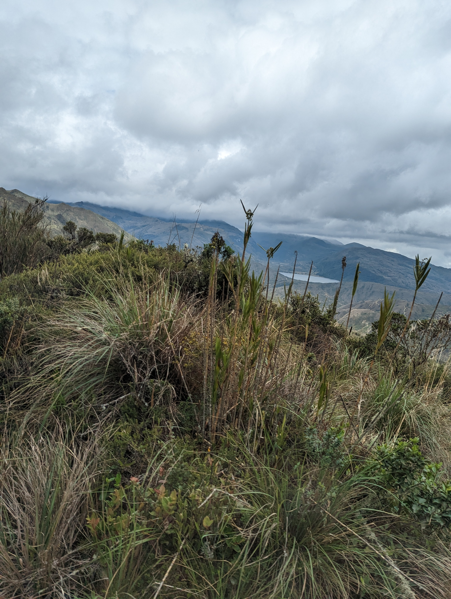
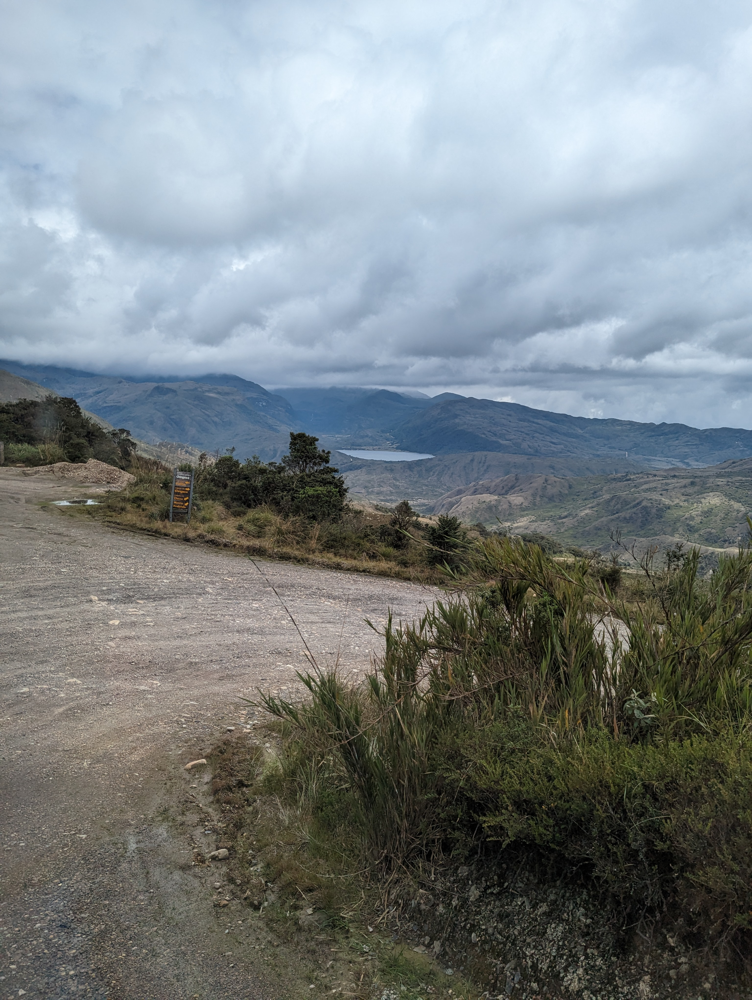
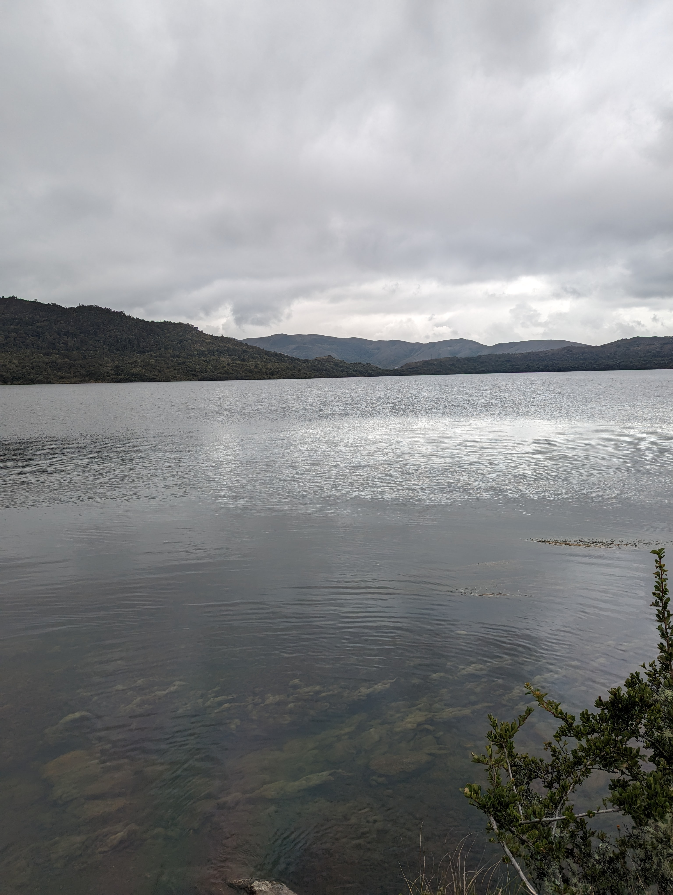
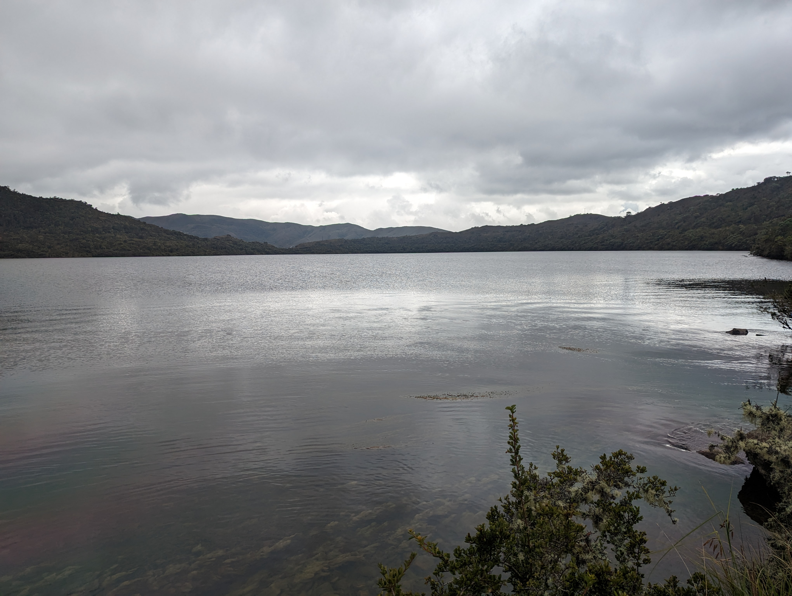
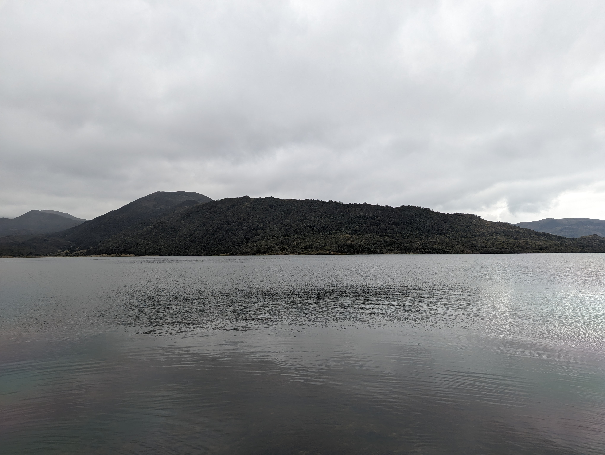

## Laguna Chingaza (2023-05-03)
Créditos: rcfdtools

geojson {"type": "Feature", "geometry": {"type": "Point", "coordinates": [-74.043193, 4.783243]}, "properties": {"Name": "xxx"}}

**File: 6/PXL_20230503_172836112.MOTION-02.ORIGINAL.jpg**. OS version: HDR+ 1.0.520435816zm. Date: 2023:05:03 12:28:36
 Coordinates & altitude: (4.5651472222222225, -73.73946388888889, 3483.93) Location over [Google Maps](http://maps.google.com/maps?q=4.5651472222222225,-73.73946388888889) or [Openstreet Map](https://www.openstreetmap.org/query?lat=4.5651472222222225&lon=-73.73946388888889)

**File: 6/PXL_20230503_172845905.MOTION-02.ORIGINAL.jpg**. OS version: HDR+ 1.0.520435816zm. Date: 2023:05:03 12:28:45
 Coordinates & altitude: (4.5651472222222225, -73.73946388888889, 3483.93) Location over [Google Maps](http://maps.google.com/maps?q=4.5651472222222225,-73.73946388888889) or [Openstreet Map](https://www.openstreetmap.org/query?lat=4.5651472222222225&lon=-73.73946388888889)

**File: 6/PXL_20230503_181920982.jpg**. OS version: HDR+ 1.0.520435816zd. Date: 2023:05:03 13:19:20
 Coordinates & altitude: (4.532322222222223, -73.74963611111112, 3234.2) Location over [Google Maps](http://maps.google.com/maps?q=4.532322222222223,-73.74963611111112) or [Openstreet Map](https://www.openstreetmap.org/query?lat=4.532322222222223&lon=-73.74963611111112)

**File: 6/PXL_20230503_181924519.jpg**. OS version: HDR+ 1.0.520435816zd. Date: 2023:05:03 13:19:24
 Coordinates & altitude: (4.532322222222223, -73.74963611111112, 3234.2) Location over [Google Maps](http://maps.google.com/maps?q=4.532322222222223,-73.74963611111112) or [Openstreet Map](https://www.openstreetmap.org/query?lat=4.532322222222223&lon=-73.74963611111112)

**File: 6/PXL_20230503_181928515.jpg**. OS version: HDR+ 1.0.520435816zd. Date: 2023:05:03 13:19:28
 Coordinates & altitude: (4.532322222222223, -73.74963611111112, 3234.2) Location over [Google Maps](http://maps.google.com/maps?q=4.532322222222223,-73.74963611111112) or [Openstreet Map](https://www.openstreetmap.org/query?lat=4.532322222222223&lon=-73.74963611111112)

