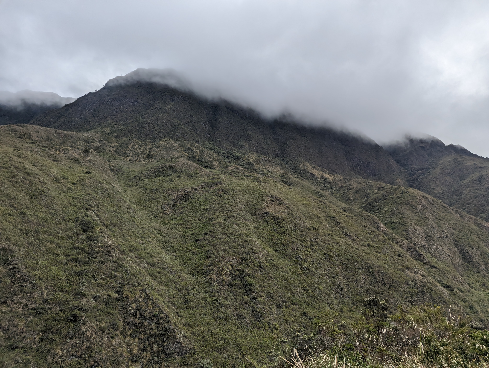
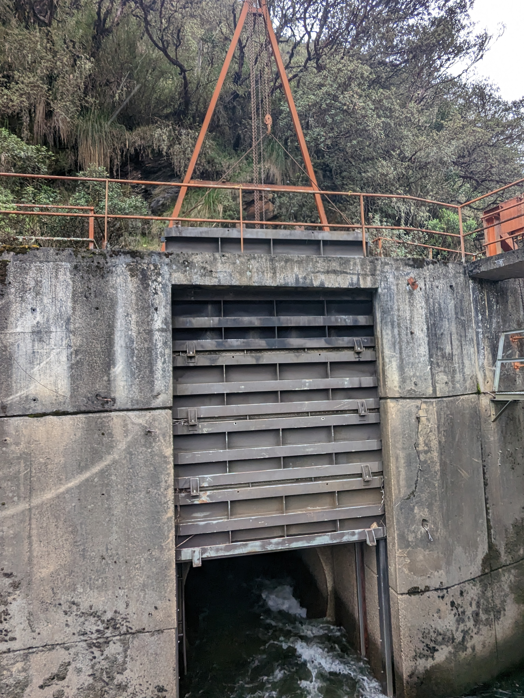
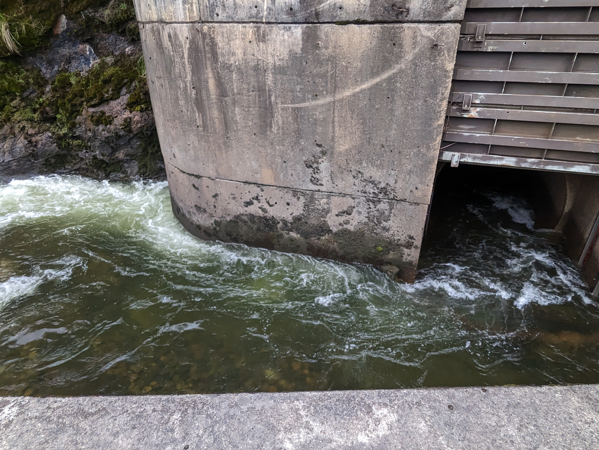
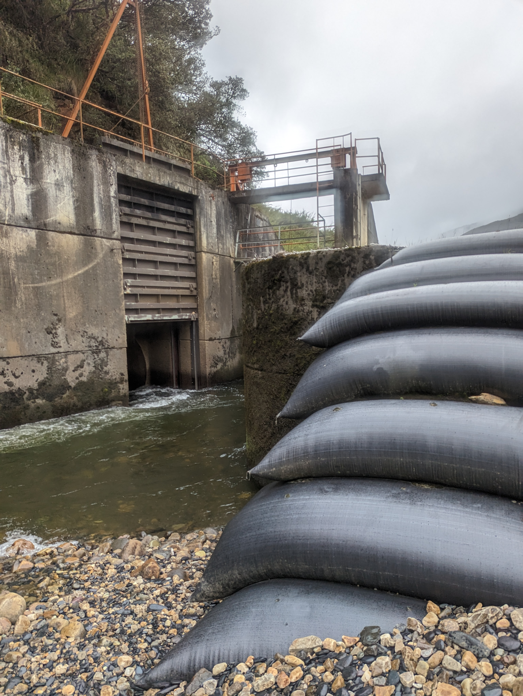
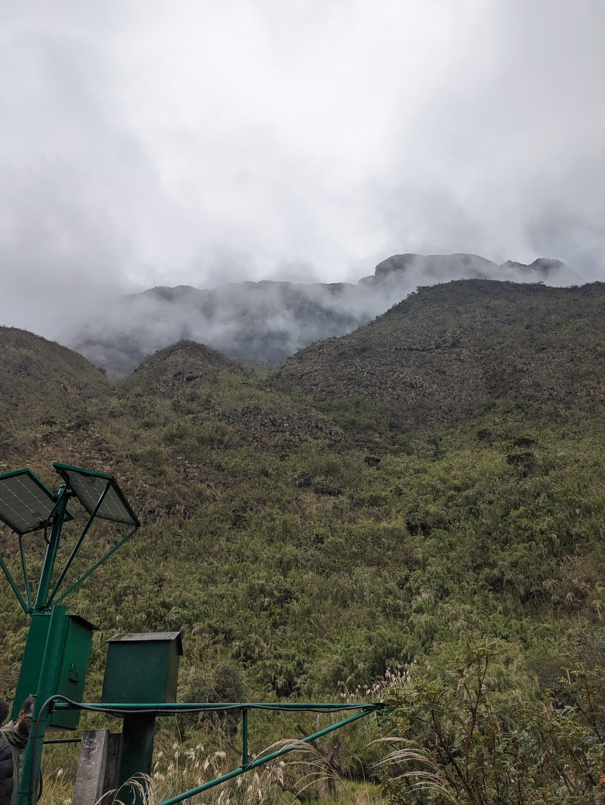

## Tunel derivador Río Guatiquía a Embalse Chuza (2023-05-03)
Créditos: rcfdtools

Image 7/PXL_20230503_184309223.MP.jpg, OS Version: HDR+ 1.0.520435816zd

Image 7/PXL_20230503_184325201.jpg, OS Version: HDR+ 1.0.520435816zd

Image 7/PXL_20230503_184338132.jpg, OS Version: HDR+ 1.0.520435816zd

Image 7/PXL_20230503_184357380.jpg, OS Version: HDR+ 1.0.520435816zd

Image 7/PXL_20230503_184402697.jpg, OS Version: HDR+ 1.0.520435816zd

Image 7/PXL_20230503_185629860.jpg, OS Version: HDR+ 1.0.520435816zd

Image 7/PXL_20230503_185652342.jpg, OS Version: HDR+ 1.0.520435816zd

Image 7/PXL_20230503_185701012.jpg, OS Version: HDR+ 1.0.520435816zd

Image 7/PXL_20230503_185704921.jpg, OS Version: HDR+ 1.0.520435816zd

Image 7/PXL_20230503_185847285.jpg, OS Version: HDR+ 1.0.520435816zd

Image 7/PXL_20230503_185849518.jpg, OS Version: HDR+ 1.0.520435816zd

Image 7/PXL_20230503_190024766.jpg, OS Version: HDR+ 1.0.520435816zd

Image 7/PXL_20230503_190026647.jpg, OS Version: HDR+ 1.0.520435816zd

Image 7/PXL_20230503_190031280.jpg, OS Version: HDR+ 1.0.520435816zd

Image 7/PXL_20230503_190041399.jpg, OS Version: HDR+ 1.0.520435816zd

Image 7/PXL_20230503_190046534.jpg, OS Version: HDR+ 1.0.520435816zd

Image 7/PXL_20230503_190049713.jpg, OS Version: HDR+ 1.0.520435816zd

Image 7/PXL_20230503_190052111.jpg, OS Version: HDR+ 1.0.520435816zd

Image 7/PXL_20230503_190409373.jpg, OS Version: HDR+ 1.0.520435816zd

Image 7/PXL_20230503_190416001.jpg, OS Version: HDR+ 1.0.520435816zd

Image 7/PXL_20230503_190425338.jpg, OS Version: HDR+ 1.0.520435816zd

Image 7/PXL_20230503_190635486.jpg, OS Version: HDR+ 1.0.520435816zd

Image 7/PXL_20230503_190658257.jpg, OS Version: HDR+ 1.0.520435816zd

Image 7/PXL_20230503_191225766.jpg, OS Version: HDR+ 1.0.520435816zd

Image 7/PXL_20230503_192623236.jpg, OS Version: HDR+ 1.0.520435816zd

