## Embalse Paujil (2013-07-03)
Créditos: rcfdtools<br>Categoría: Technical field visit

```geojson
{
  "type": "Feature",
  "geometry": {
    "type": "Point", 
    "coordinates": [-73.458466, 9.559278]
  }, 
  "properties": {
    "Name": "Embalse Paujil"
  }
}
```

**File: 8/2013-07-03_15.37.12.jpg**. OS version: N7000XXLS2. Date: 2013:07:03 15:37:12
<br>Coordinates & altitude: (9.5593278, -73.4585915, 71.31)<br>Location over [Google Maps](http://maps.google.com/maps?q=9.5593278,-73.4585915) or [Openstreet Map](https://www.openstreetmap.org/query?lat=9.5593278&lon=-73.4585915)
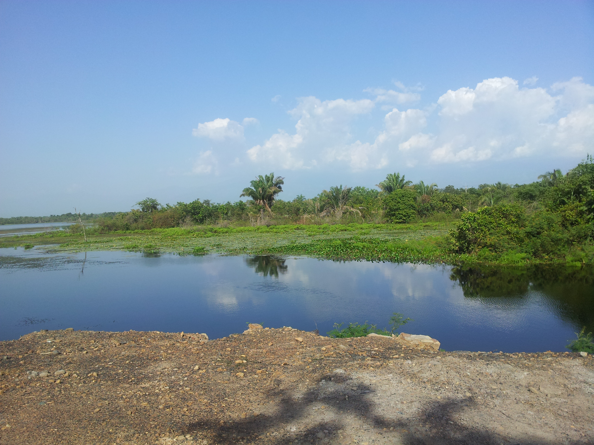

**File: 8/2013-07-03_15.37.24.jpg**. OS version: N7000XXLS2. Date: 2013:07:03 15:37:24
<br>Coordinates & altitude: (9.5593278, -73.4585915, 71.31)<br>Location over [Google Maps](http://maps.google.com/maps?q=9.5593278,-73.4585915) or [Openstreet Map](https://www.openstreetmap.org/query?lat=9.5593278&lon=-73.4585915)
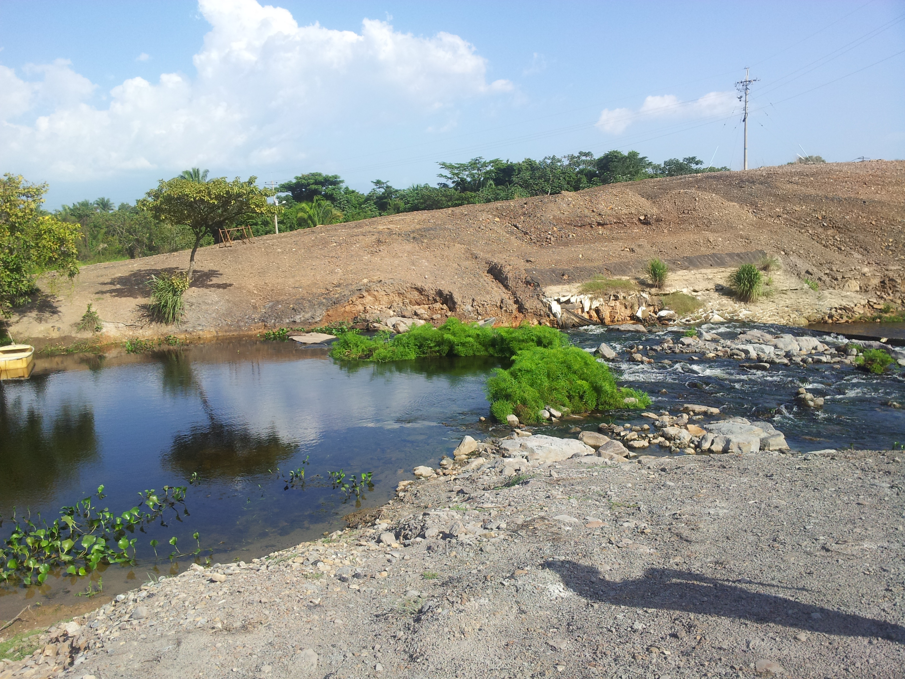

**File: 8/2013-07-03_15.37.32.jpg**. OS version: N7000XXLS2. Date: 2013:07:03 15:37:32
<br>Coordinates & altitude: (9.5593278, -73.4585915, 71.31)<br>Location over [Google Maps](http://maps.google.com/maps?q=9.5593278,-73.4585915) or [Openstreet Map](https://www.openstreetmap.org/query?lat=9.5593278&lon=-73.4585915)
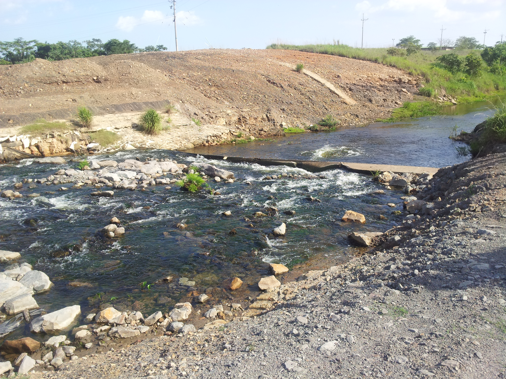

**File: 8/2013-07-03_15.37.54.jpg**. OS version: N7000XXLS2. Date: 2013:07:03 15:37:54
<br>Coordinates & altitude: (9.5593278, -73.4585915, 71.31)<br>Location over [Google Maps](http://maps.google.com/maps?q=9.5593278,-73.4585915) or [Openstreet Map](https://www.openstreetmap.org/query?lat=9.5593278&lon=-73.4585915)
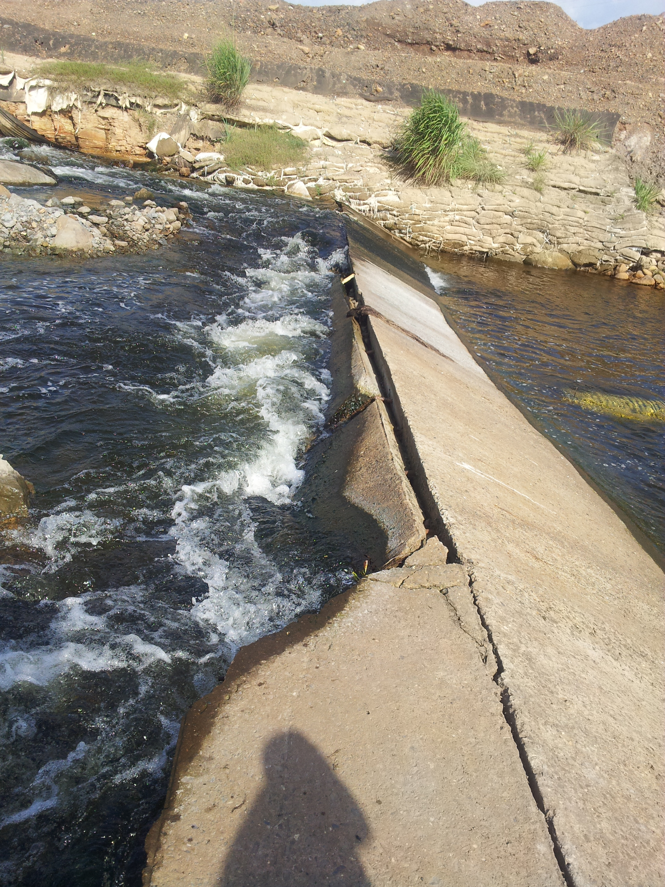

**File: 8/2013-07-03_15.37.57.jpg**. OS version: N7000XXLS2. Date: 2013:07:03 15:37:57
<br>Coordinates & altitude: (9.5593278, -73.4585915, 71.31)<br>Location over [Google Maps](http://maps.google.com/maps?q=9.5593278,-73.4585915) or [Openstreet Map](https://www.openstreetmap.org/query?lat=9.5593278&lon=-73.4585915)
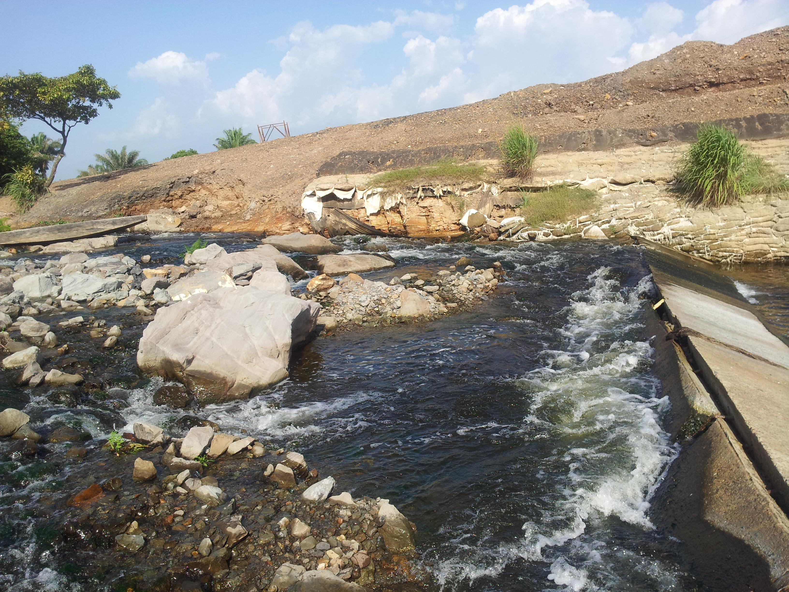

**File: 8/2013-07-03_15.38.01.jpg**. OS version: N7000XXLS2. Date: 2013:07:03 15:38:01
<br>Coordinates & altitude: (9.5593278, -73.4585915, 71.31)<br>Location over [Google Maps](http://maps.google.com/maps?q=9.5593278,-73.4585915) or [Openstreet Map](https://www.openstreetmap.org/query?lat=9.5593278&lon=-73.4585915)
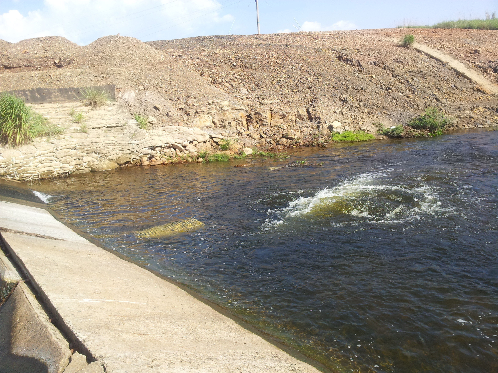

**File: 8/2013-07-03_15.38.05.jpg**. OS version: N7000XXLS2. Date: 2013:07:03 15:38:05
<br>Coordinates & altitude: (9.5593278, -73.4585915, 71.31)<br>Location over [Google Maps](http://maps.google.com/maps?q=9.5593278,-73.4585915) or [Openstreet Map](https://www.openstreetmap.org/query?lat=9.5593278&lon=-73.4585915)
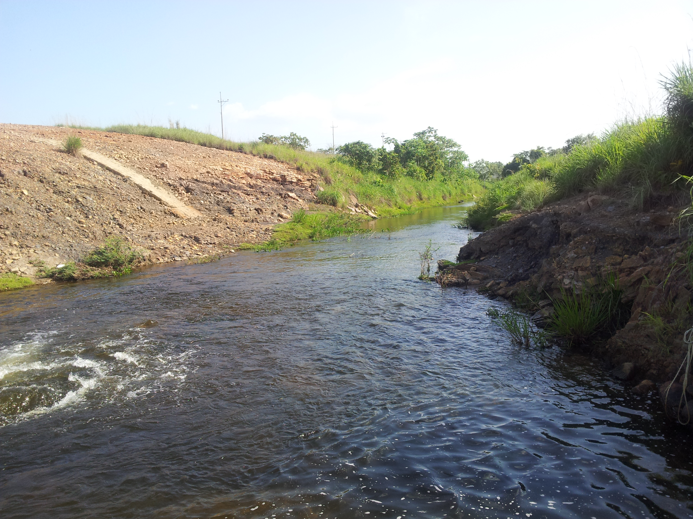

**File: 8/2013-07-03_15.38.29.jpg**. OS version: N7000XXLS2. Date: 2013:07:03 15:38:29
<br>Coordinates & altitude: (9.5593278, -73.4585915, 71.31)<br>Location over [Google Maps](http://maps.google.com/maps?q=9.5593278,-73.4585915) or [Openstreet Map](https://www.openstreetmap.org/query?lat=9.5593278&lon=-73.4585915)
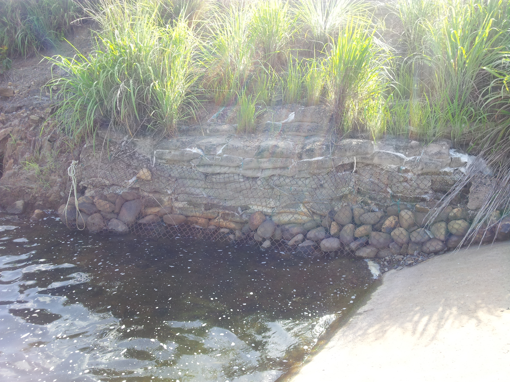

**File: 8/2013-07-03_15.38.33.jpg**. OS version: N7000XXLS2. Date: 2013:07:03 15:38:33
<br>Coordinates & altitude: (9.5593278, -73.4585915, 71.31)<br>Location over [Google Maps](http://maps.google.com/maps?q=9.5593278,-73.4585915) or [Openstreet Map](https://www.openstreetmap.org/query?lat=9.5593278&lon=-73.4585915)
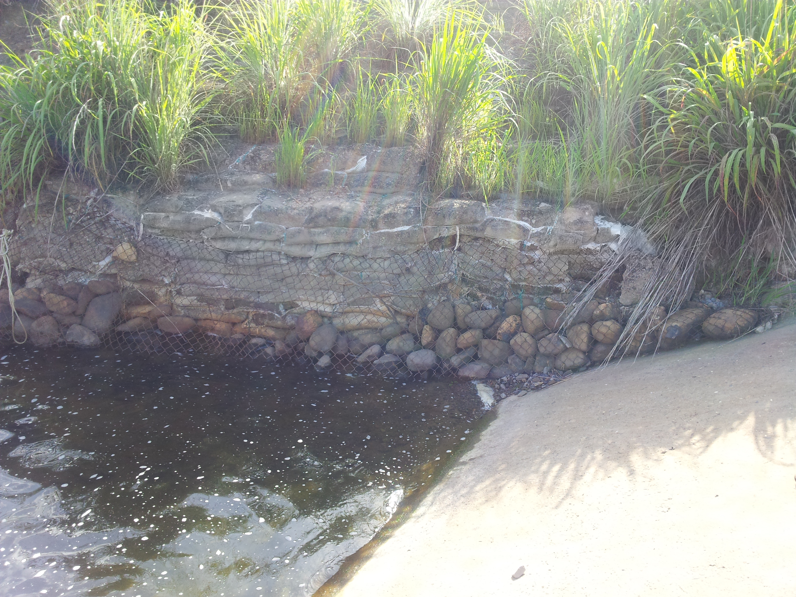

**File: 8/2013-07-03_15.38.55.jpg**. OS version: N7000XXLS2. Date: 2013:07:03 15:38:55
<br>Coordinates & altitude: (9.5593278, -73.4585915, 71.31)<br>Location over [Google Maps](http://maps.google.com/maps?q=9.5593278,-73.4585915) or [Openstreet Map](https://www.openstreetmap.org/query?lat=9.5593278&lon=-73.4585915)
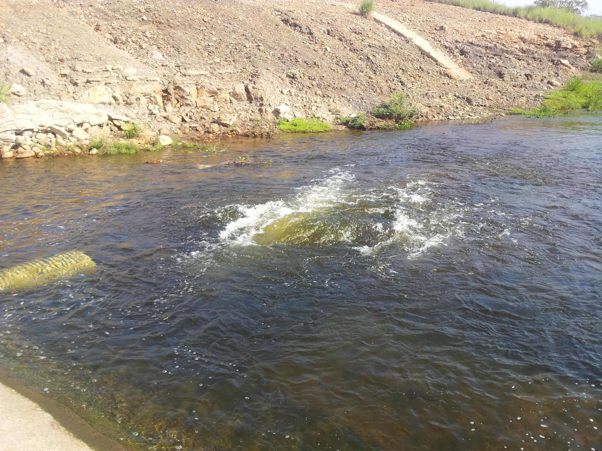

**File: 8/2013-07-03_15.39.42.jpg**. OS version: N7000XXLS2. Date: 2013:07:03 15:39:42
<br>Coordinates & altitude: (9.5593278, -73.4585915, 71.31)<br>Location over [Google Maps](http://maps.google.com/maps?q=9.5593278,-73.4585915) or [Openstreet Map](https://www.openstreetmap.org/query?lat=9.5593278&lon=-73.4585915)
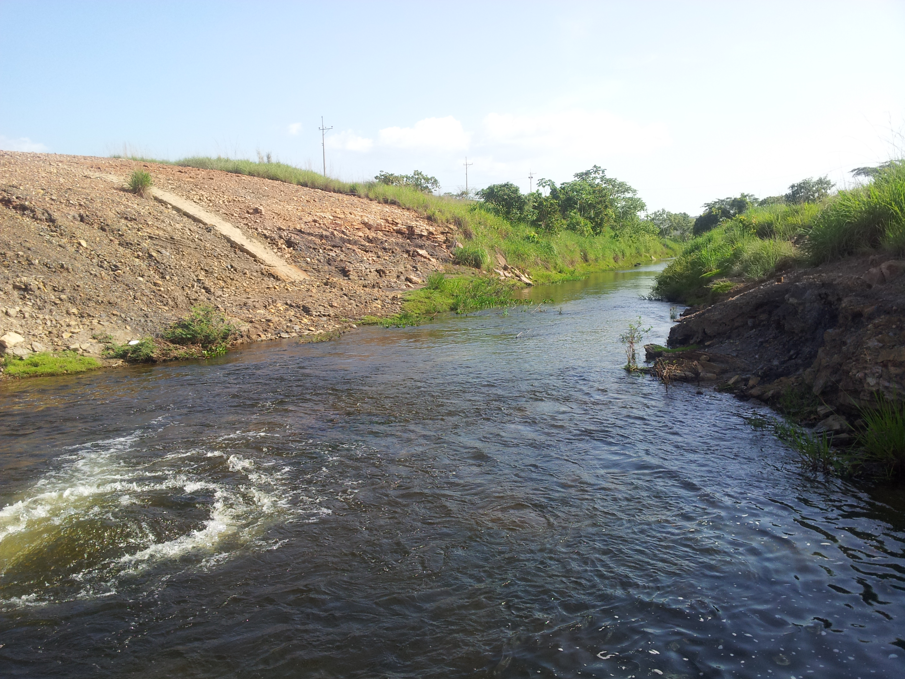

**File: 8/2013-07-03_15.39.48.jpg**. OS version: N7000XXLS2. Date: 2013:07:03 15:39:48
<br>Coordinates & altitude: (9.5593278, -73.4585915, 71.31)<br>Location over [Google Maps](http://maps.google.com/maps?q=9.5593278,-73.4585915) or [Openstreet Map](https://www.openstreetmap.org/query?lat=9.5593278&lon=-73.4585915)
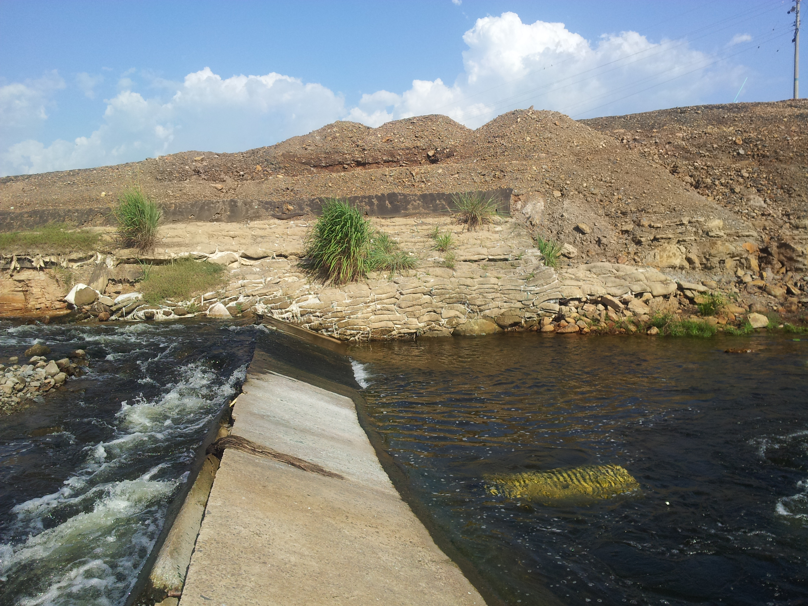

| [:house: Inicio](../Readme.md) |
|---|