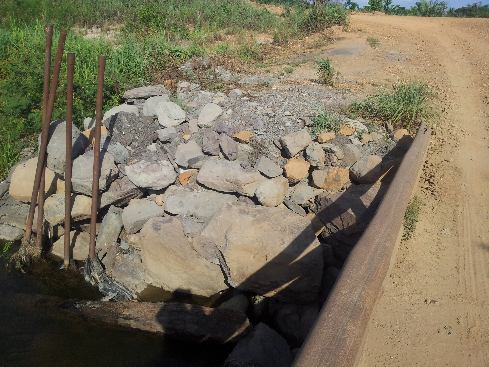
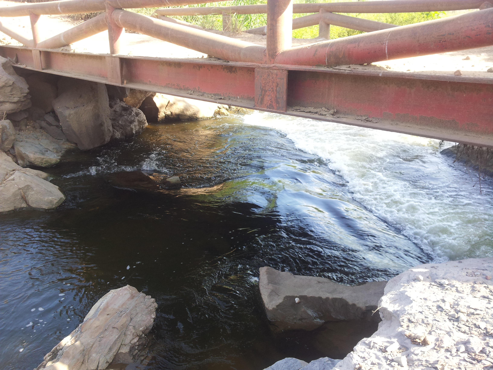
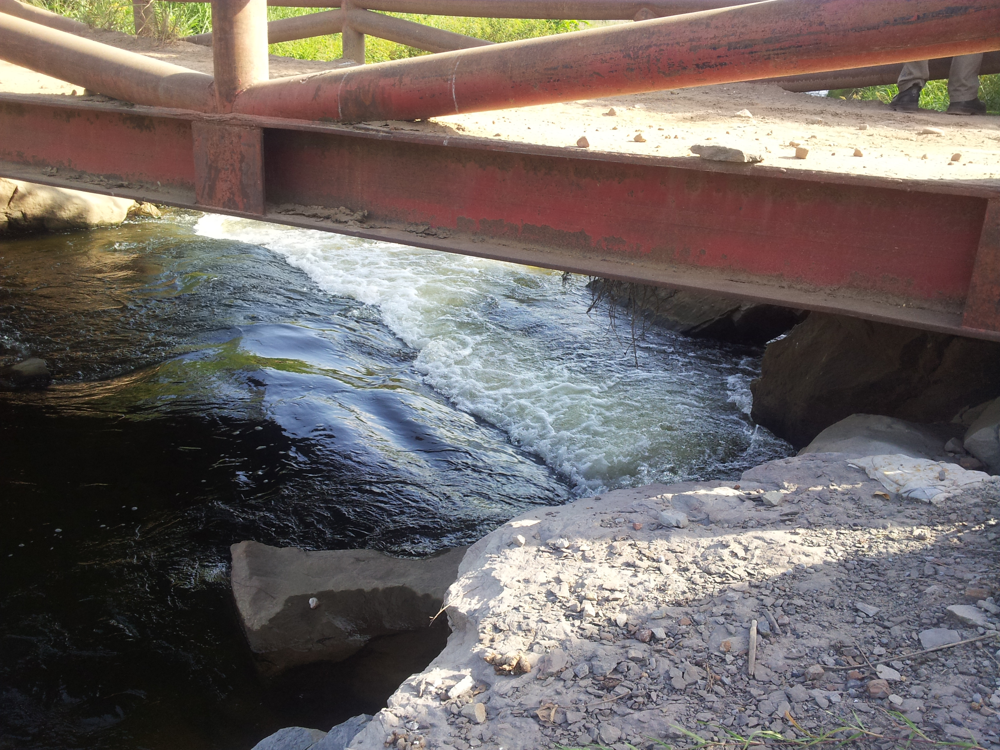
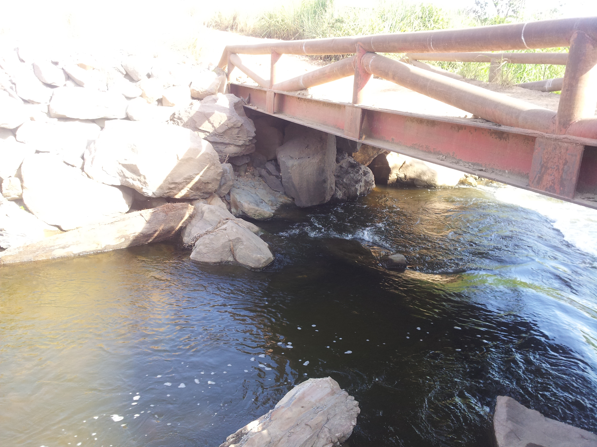
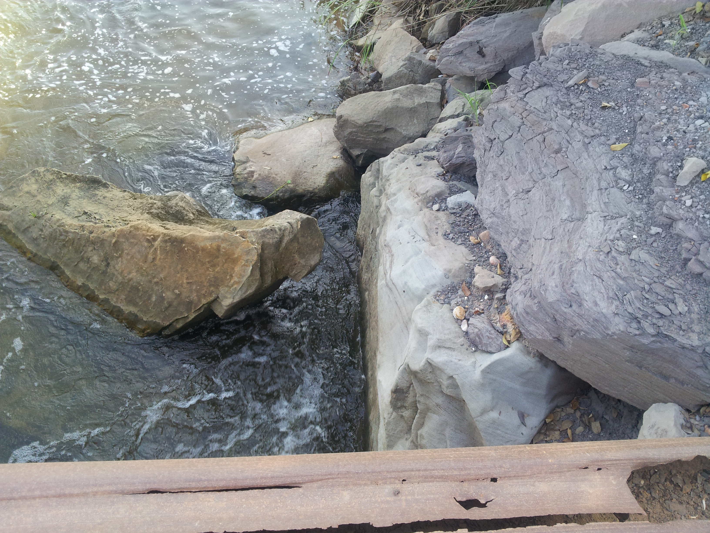
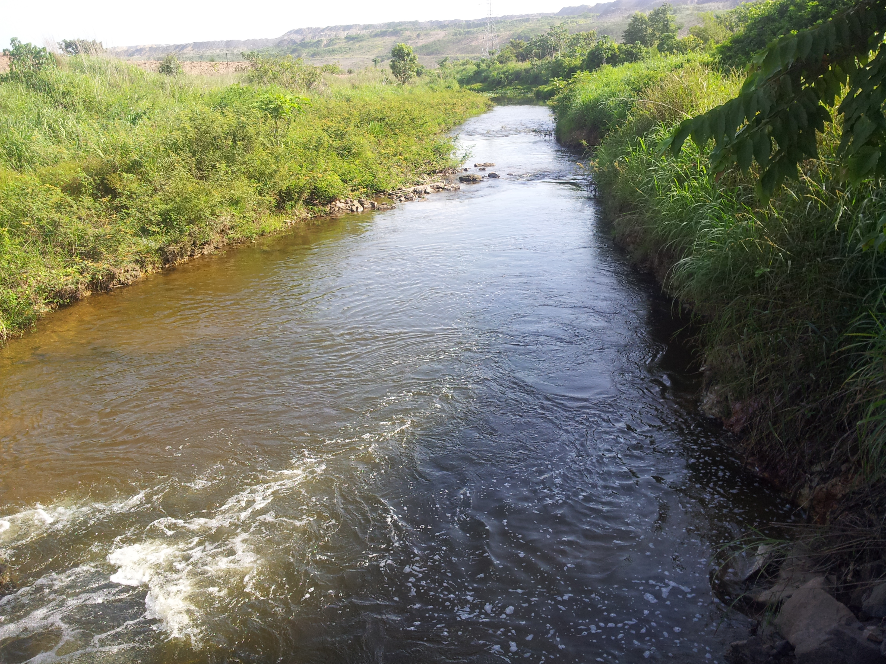
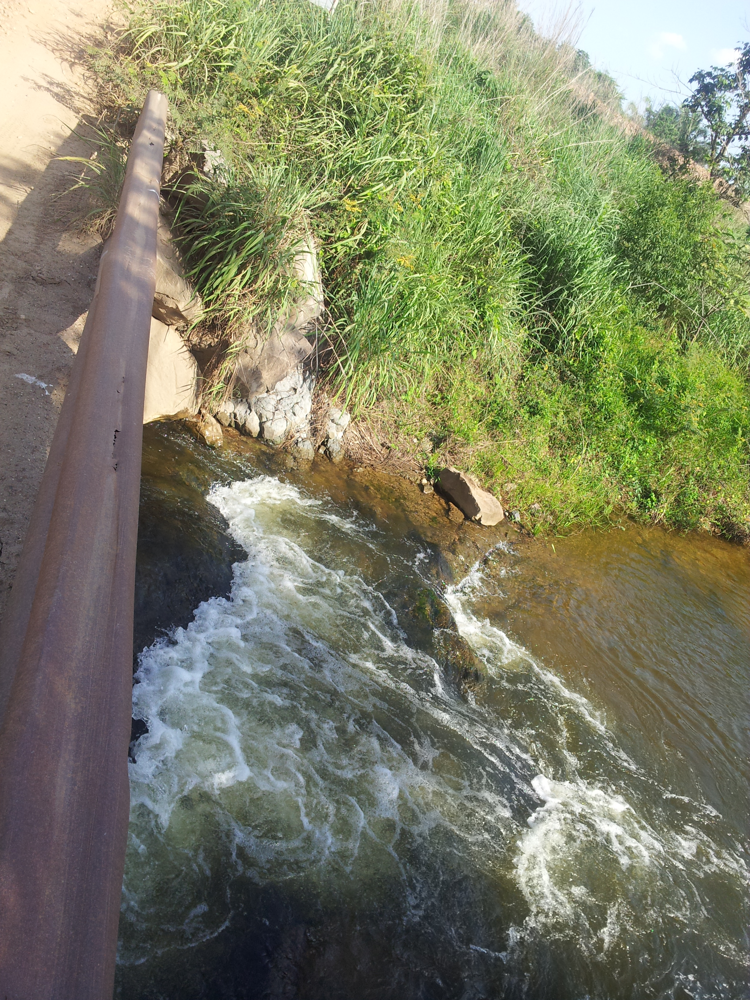
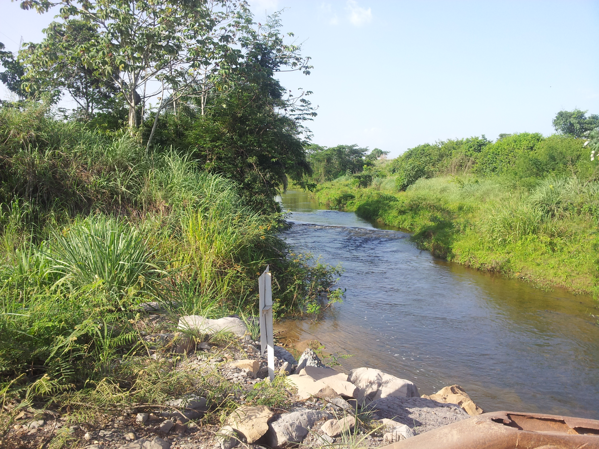

## Paso de vía Canal Paujil (2013-07-04)
Créditos: rcfdtools<br>Categoría: Technical field visit

```geojson
{
  "type": "Feature",
  "geometry": {
    "type": "Point", 
    "coordinates": [-73.4642336, 9.5532847]
  }, 
  "properties": {
    "Name": "Paso de vía Canal Paujil"
  }
}
```

**File: 9/2013-07-03_15.48.23.jpg**. OS version: N7000XXLS2. Date: 2013:07:03 15:48:23
<br>Coordinates & altitude: (9.5532847, -73.4642336, 70.18)<br>Location over [Google Maps](http://maps.google.com/maps?q=9.5532847,-73.4642336) or [Openstreet Map](https://www.openstreetmap.org/query?lat=9.5532847&lon=-73.4642336)


**File: 9/2013-07-03_15.48.54.jpg**. OS version: N7000XXLS2. Date: 2013:07:03 15:48:54
<br>Coordinates & altitude: (9.5532847, -73.4642336, 70.18)<br>Location over [Google Maps](http://maps.google.com/maps?q=9.5532847,-73.4642336) or [Openstreet Map](https://www.openstreetmap.org/query?lat=9.5532847&lon=-73.4642336)


**File: 9/2013-07-03_15.48.57.jpg**. OS version: N7000XXLS2. Date: 2013:07:03 15:48:57
<br>Coordinates & altitude: (9.5532847, -73.4642336, 70.18)<br>Location over [Google Maps](http://maps.google.com/maps?q=9.5532847,-73.4642336) or [Openstreet Map](https://www.openstreetmap.org/query?lat=9.5532847&lon=-73.4642336)


**File: 9/2013-07-03_15.49.00.jpg**. OS version: N7000XXLS2. Date: 2013:07:03 15:49:00
<br>Coordinates & altitude: (9.5532847, -73.4642336, 70.18)<br>Location over [Google Maps](http://maps.google.com/maps?q=9.5532847,-73.4642336) or [Openstreet Map](https://www.openstreetmap.org/query?lat=9.5532847&lon=-73.4642336)


**File: 9/2013-07-03_15.49.16.jpg**. OS version: N7000XXLS2. Date: 2013:07:03 15:49:16
<br>Coordinates & altitude: (9.5532847, -73.4642336, 70.18)<br>Location over [Google Maps](http://maps.google.com/maps?q=9.5532847,-73.4642336) or [Openstreet Map](https://www.openstreetmap.org/query?lat=9.5532847&lon=-73.4642336)


**File: 9/2013-07-03_15.49.20.jpg**. OS version: N7000XXLS2. Date: 2013:07:03 15:49:20
<br>Coordinates & altitude: (9.5532847, -73.4642336, 70.18)<br>Location over [Google Maps](http://maps.google.com/maps?q=9.5532847,-73.4642336) or [Openstreet Map](https://www.openstreetmap.org/query?lat=9.5532847&lon=-73.4642336)


**File: 9/2013-07-03_15.49.25.jpg**. OS version: N7000XXLS2. Date: 2013:07:03 15:49:25
<br>Coordinates & altitude: (9.5532847, -73.4642336, 70.18)<br>Location over [Google Maps](http://maps.google.com/maps?q=9.5532847,-73.4642336) or [Openstreet Map](https://www.openstreetmap.org/query?lat=9.5532847&lon=-73.4642336)


**File: 9/2013-07-03_15.49.33.jpg**. OS version: N7000XXLS2. Date: 2013:07:03 15:49:33
<br>Coordinates & altitude: (9.5532847, -73.4642336, 70.18)<br>Location over [Google Maps](http://maps.google.com/maps?q=9.5532847,-73.4642336) or [Openstreet Map](https://www.openstreetmap.org/query?lat=9.5532847&lon=-73.4642336)


| [:house: Inicio](../Readme.md) |
|---|