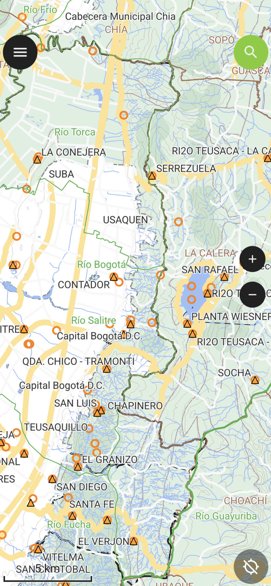
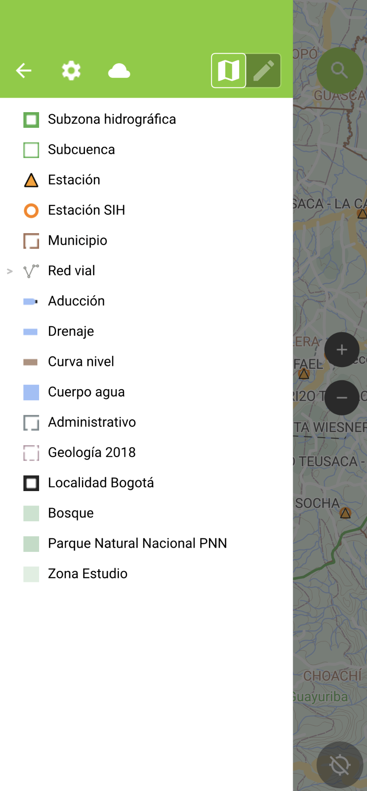
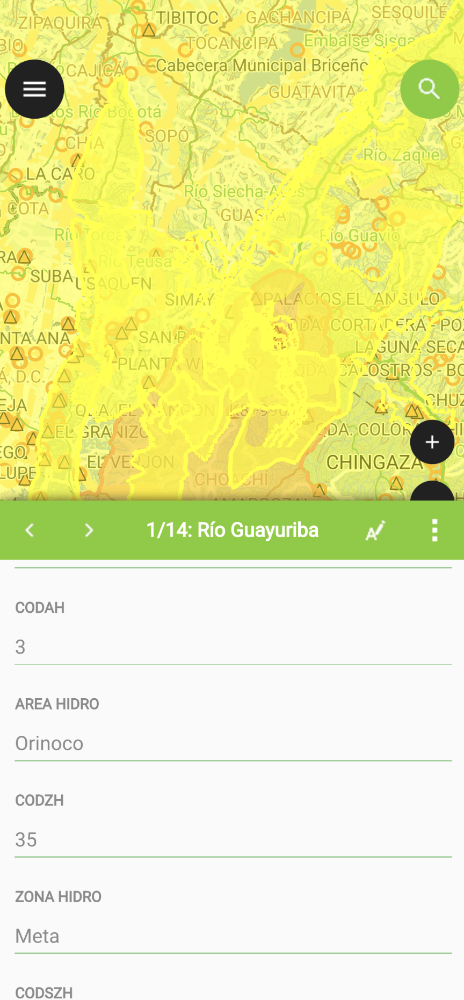

## GIS Mobile EAB-CO

<div align="center">
  
  
  
</div>

Sistema de información geográfico móvil a partir de datos públicos de la Empresa de Acueducto y Alcantarillado de Bogotá D.C. - Colombia y otras fuentes.

En Colombia la Ley de Transparencia y Acceso a la Información, define los datos abiertos como “todos aquellos datos primarios o sin procesar, que se encuentran en formatos estándar e interoperables que facilitan su acceso y reutilización, los cuales están bajo la custodia de las entidades públicas o privadas que cumplen con funciones públicas y que son puestos a disposición de cualquier ciudadano, de forma libre y sin restricciones, con el fin de que terceros puedan reutilizarlos y crear servicios derivados de los mismos” (Ley 1712 de 2014. Literal J, artículo 6. Definiciones.)


### Sistema de proyección de coordenadas - CRS

Origen nacional único Colombia EPSG: 9377 o ESRI: 103599 [^1]

El establecimiento de las condiciones técnicas mínimas que deben tener los productos básicos de cartografía oficial, serán los definidos de conformidad con lo dispuesto por la Resolución 471 del 14 de mayo de 2020 y la posterior Resolución 529 del 05 de junio de 2020, emitidas por el Instituto Geográfico Agustín Codazzi - IGAC, o la norma que la modifique y sustituya, para ello y para garantizar la homogeneidad y continuidad en la representación de los elementos del territorio, así como facilitar los trabajos relacionados con la gestión de coordenadas en el país. En tal sentido, los proyectos, obras o actividades, sujetos al licenciamiento ambiental, deben ajustar su información geográfica a los lineamientos establecidos en la referida normatividad, para la evaluación y seguimiento de los estudios ambientales y/o presentación de los Informes de Cumplimiento Ambiental.

El sistema de proyección cartográfico para Colombia, con un único origen, consiste en una proyección cartográfica Transversa de Mercator Secante, cuyos parámetros están establecidos en el literal i Sistema de Referencia del artículo 4 de la resolución 471 de 2020, los cuales pueden configurarse en software especializado para procesamiento de información geográfica.

```
MAGNA_Colombia_Origen_Unico
Authority: Custom

Projection: Transverse_Mercator
False_Easting: 5000000.0
False_Northing: 2000000.0
Central_Meridian: -73.0
Scale_Factor: 0.9992
Latitude_Of_Origin: 4.0
Linear Unit: Meter (1.0)

Geographic Coordinate System: GCS_MAGNA
Angular Unit: Degree (0.0174532925199433)
Prime Meridian: Greenwich (0.0)
Datum: D_MAGNA
  Spheroid: GRS_1980
    Semimajor Axis: 6378137.0
    Semiminor Axis: 6356752.314140356
    Inverse Flattening: 298.257222101
```

### Datasets & Feature Class


#### Dataset EAB

| Feature class      | Descripción                                                                                                                                                                                      | Fuente                                                                                                                                                                           | Licencia                                                                                 |
|:-------------------|:-------------------------------------------------------------------------------------------------------------------------------------------------------------------------------------------------|:---------------------------------------------------------------------------------------------------------------------------------------------------------------------------------|:-----------------------------------------------------------------------------------------|
| eab_aduccion       | Aducciones sistema de abastecimiento de Bogotá D.C.                                                                                                                                              | [Empresa de Acueducto y Alcantarillado de Bogotá](www.acueducto.com.co) <br>Mapa de cuencas abastecedoras de la ciudad y la región                                               | [Ley 1712 de 2014](http://www.secretariasenado.gov.co/senado/basedoc/ley_1712_2014.html) |
| eab_sih_estaciones | Red de estaciones Sistema de Información Hídrico - SIH Bogotá D.C. y zonas perimetrales                                                                                                          | [Empresa de Acueducto y Alcantarillado de Bogotá](www.acueducto.com.co)                                                                                                          | [Ley 1712 de 2014](http://www.secretariasenado.gov.co/senado/basedoc/ley_1712_2014.html) |
| hdg_Cuenca         | Cuencas hidrográficas Bogotá D.C y zonas perimetrales                                                                                                                                            | [Empresa de Acueducto y Alcantarillado de Bogotá](www.acueducto.com.co) <br>[Datos abiertos Bogotá](https://datosabiertos.bogota.gov.co/dataset/cuenca-bogota-d-c)               | [Ley 1712 de 2014](http://www.secretariasenado.gov.co/senado/basedoc/ley_1712_2014.html) |
| hdg_CuerpoAgua     | Cuerpos de agua Bogotá D.C. y zonas perimetrales                                                                                                                                                 | [Empresa de Acueducto y Alcantarillado de Bogotá](www.acueducto.com.co) <br>[Datos abiertos Bogotá](https://datosabiertos.bogota.gov.co/dataset/cuerpo-de-agua-bogota-d-c)       | [Ley 1712 de 2014](http://www.secretariasenado.gov.co/senado/basedoc/ley_1712_2014.html) |
| hdg_Drenaje        | Drenajes Bogotá D.C. y zonas perimetrales                                                                                                                                                        | [Empresa de Acueducto y Alcantarillado de Bogotá](www.acueducto.com.co) <br>[Datos abiertos Bogotá](https://datosabiertos.bogota.gov.co/dataset/corriente-de-agua-bogota-d-c)    | [Ley 1712 de 2014](http://www.secretariasenado.gov.co/senado/basedoc/ley_1712_2014.html) |
| hdg_SubCuenca      | Subcuencas hidrográficas Bogotá D.C y zonas perimetrales                                                                                                                                         | [Empresa de Acueducto y Alcantarillado de Bogotá](www.acueducto.com.co) <br>[Datos abiertos Bogotá](https://datosabiertos.bogota.gov.co/dataset/subcuenca-bogota-d-c)            | [Ley 1712 de 2014](http://www.secretariasenado.gov.co/senado/basedoc/ley_1712_2014.html) |
| hdg_SubZonaHidro   | Subzonificación hidrográfica Bogotá D.C y zonas perimetrales (Adaptado de: IDEAM, zonificación y codificación de unidades hidrográficas e hidrogeológicas de Colombia, Bogotá, D. C., Colombia). | [Empresa de Acueducto y Alcantarillado de Bogotá](www.acueducto.com.co) <br>[Datos abiertos Bogotá](https://datosabiertos.bogota.gov.co/dataset/subzona-hidrografica-bogota-d-c) | [Ley 1712 de 2014](http://www.secretariasenado.gov.co/senado/basedoc/ley_1712_2014.html) |
| eab_ZonaEstudio    | Polígono envolvente (aferencia 5 km) sobre subzonas hidrográficas IDEAM con cobertura sobre  Bogotá D.C. y zonas perimetrales                                                                    | [rcfdtools](https://github.com/rcfdtools)                                                                                                                                        | [CC BY 4.0](https://creativecommons.org/licenses/by/4.0/deed.es)                         |
| SRTM_3s_3000       | Elevación 3000 m.s.n.m o superior. A partir del modelo digital de elevación SRTM. Suavizado cartográfico 1000m                                                                                   | [rcfdtools](https://github.com/rcfdtools)                                                                                                                                        | [CC BY 4.0](https://creativecommons.org/licenses/by/4.0/deed.es)                         |


#### Dataset General

| Feature class                         | Descripción                                                                       | Fuente                                                                                                                                                                                           | Licencia                                                                                 |
|:--------------------------------------|:----------------------------------------------------------------------------------|:-------------------------------------------------------------------------------------------------------------------------------------------------------------------------------------------------|:-----------------------------------------------------------------------------------------|
| Via                                   | Red vial nacional orden 1 a 6, caminos, senderos, peatonales urbanas              | www.colombiaenmapas.gov.co <br>Base de datos vectorial básica de Colombia. Escala 1:100.000<br>Fecha: 01-04-2022<br>Dataset: Transporte_Terrestre                                                | [CC BY 4.0](https://creativecommons.org/licenses/by/4.0/deed.es)                         |
| Administrativo_R                      | Barrios, cabeceras municipales, caseríos, capitales, corregimientos, inspecciones | www.colombiaenmapas.gov.co <br>Base de datos vectorial básica de Colombia. Escala 1:100.000<br>Fecha: 01-04-2022<br>Dataset: Entidades_Territoriales_y_Unidades_Administrativas                  | [CC BY 4.0](https://creativecommons.org/licenses/by/4.0/deed.es)                         |
| BogotaLocalidad                       | Localidades de Bogotá D.C.                                                        | https://www.ideca.gov.co/recursos/mapas/localidad-bogota-dc <br>Entidad: Secretaría Distrital de Planeación<br>Fecha de actualización del contenido: 30/06/2020<br>Fuente: Datos Abiertos Bogotá | [CC BY 4.0](https://creativecommons.org/licenses/by/4.0/deed.es)                         |
| Bosque                                | Bosques de Colombia                                                               | www.colombiaenmapas.gov.co <br>Base de datos vectorial básica de Colombia. Escala 1:100.000<br>Fecha: 01-04-2022<br>Dataset: Cobertura_Vegetal                                                   | [CC BY 4.0](https://creativecommons.org/licenses/by/4.0/deed.es)                         |
| CurvaNivel                            | Curvas de nivel secundarias cada 20m y principales cada 100m                      | www.colombiaenmapas.gov.co <br>Base de datos vectorial básica de Colombia. Escala 1:100.000<br>Fecha: 01-04-2022<br>Dataset: Relieve                                                             | [CC BY 4.0](https://creativecommons.org/licenses/by/4.0/deed.es)                         |
| MapaGeologico2018                     | Unidades cronoestratigráficas de Colombia                                         | www.colombiaenmapas.gov.co <br>Entidad: Servicio Geológico Colombiano - SGC. Escala 1:100.000<br>Fecha: 13-06-2018                                                                               | [CC BY 4.0](https://creativecommons.org/licenses/by/4.0/deed.es)                         |
| Municipios2022                        | Municipios de Colombia                                                            | www.colombiaenmapas.gov.co <br>Base de datos vectorial básica de Colombia. Escala 1:100.000<br>Fecha: 01-04-2022                                                                                 | [CC BY 4.0](https://creativecommons.org/licenses/by/4.0/deed.es)                         |
| pnn_parques_nacional_natural_colombia | Parque Nacional Natural de Colombia                                               | www.colombiaenmapas.gov.co <br>Entidad: Parques Nacionales Naturales - PNN. Escala no indicada<br>Fecha: 01-01-2020                                                                              | [CC BY 4.0](https://creativecommons.org/licenses/by/4.0/deed.es)                         |
| Via                                   | Vías de Colombia                                                                  | www.colombiaenmapas.gov.co <br>Base de datos vectorial básica de Colombia. Escala 1:100.000<br>Fecha: 01-04-2022<br>Dataset: Transporte_Terrestre                                                | [CC BY 4.0](https://creativecommons.org/licenses/by/4.0/deed.es)                         |
| car_estaciones                        | Catálogo de estaciones activas - CAR - Cundinamarca - Colombia                    | [Corporación Autónoma Regional de Cundinamarca – CAR. Catálogo de Estaciones Activas. Año 2020](https://www.car.gov.co/vercontenido/2524)                                                        | [Ley 1712 de 2014](http://www.secretariasenado.gov.co/senado/basedoc/ley_1712_2014.html) |
| ideam_cne                             | Catálogo nacional de estaciones Colombia - CNE - IDEAM                            | [IDEAM - Instituto de Hidrología, Meteorología y Estudios Ambientales](http://www.ideam.gov.co/solicitud-de-informacion)<br>Versión: 2023.02.02                                                  | [Ley 1712 de 2014](http://www.secretariasenado.gov.co/senado/basedoc/ley_1712_2014.html) |


### Modelos digitales de elevación - dem

#### SRTM

* SRTM_3s.tif: 

#### DEM Alos Palsar 12.5m

Imágenes utilizadas para creación de mosaico.

* AP_26112_FBS_F0060_RT1.dem.tif
* AP_26112_FBS_F0070_RT1.dem.tif
* AP_26958_FBS_F0060_RT1.dem.tif
* AP_26958_FBS_F0070_RT1.dem.tif
* AP_26958_FBS_F0080_RT1.dem.tif
* AP_26958_FBS_F0090_RT1.dem.tif
* AP_27133_FBS_F0060_RT1.dem.tif
* AP_27133_FBS_F0070_RT1.dem.tif
* AP_27133_FBS_F0080_RT1.dem.tif
* AP_27133_FBS_F0090_RT1.dem.tif
* AP_27206_FBS_F0060_RT1.dem.tif
* AP_27206_FBS_F0070_RT1.dem.tif
* AP_27206_FBS_F0080_RT1.dem.tif
* AP_27206_FBS_F0090_RT1.dem.tif
* AP_27381_FBS_F0060_RT1.dem.tif
* AP_27381_FBS_F0070_RT1.dem.tif
* AP_27381_FBS_F0080_RT1.dem.tif
* AP_27381_FBS_F0090_RT1.dem.tif

[^1]: Tomado o adaptado de: https://www.anla.gov.co/01_anla/entidad/subdirecciones-y-oficinas/instrumentos-permisos-y-tramites-ambientales/sistema-de-informacion-geografica