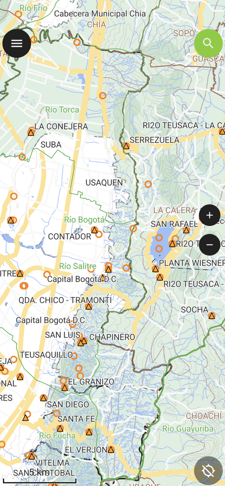

## GIS Mobile

     

Sistemas de información geográficos móviles que no requieren de conexión a Internet para su navegación. 

Atención: la información utilizada para la creación de los proyectos GIS Mobile ha sido tomada de servicios de uso libre, consulte la licencia y restricciones de uso específicas de cada fuente de datos referenciada.

GIS Mobile utiliza bases de datos geográficas en formato File Geodatabase de ESRI y despliegue a través de [QGIS](https://qgis.org/) en desktop y [QField](https://github.com/opengisch/QField) sobre dispositivos Android e iOS.

### Descargas

* [GIS Mobile EAB-CO](GISMobile_EAB_CO)

### Instrucciones de instalación

1. Desde el [Play Store en Android](https://play.google.com/) o desde [App Store en iOS](https://www.apple.com/co/app-store/), instale la App [QField](https://play.google.com/store/search?q=qfield&c=apps) de [OPENGIS.ch](https://qfield.org/) 
2. Descargue el comprimido GIS Mobile de [rcfdtools](https://github.com/rcfdtools). Dentro de cada proyecto encontrará carpetas con as versiones disponible, p.ej. v20230430. Se recomienda instalar la última versión disponible
3. En la raíz de su dispositivo o en la carpeta de descargas, cree una carpeta con el nombre `GISMobile` y descomprima los archivos (GDB.gdb y GISMobilexxx.qgz).
4. Abra QField y de clic en el botón `Open local file`
5. En la parte inferior derecha, de clic en el botón `+`, seleccione la opción `Import project from folder`
6. Busque la carpeta creada y de clic en el botón `Use this folder`. De clic en el botón `Allow` para permitir que QFiel acceda a los archivos del directorio. En caso de que tenga una versión previa importada, de clic en la opción `IMPORT AND OVERWRITE`.
7. Una vez finalizada la importación de clic en el archivo `GISMobilexxx.qgz` para abrir el mapa. Espere a que se cargue el mapa en su dispositivo.

> Dependiendo del tipo de dispositivo móvil, la apertura del mapa podrá tardar algunos minutos, una vez cargado podrá navegar por el mapa de forma fluida.

### Descargos de responsabilidad

[rcfdtools](https://github.com/rcfdtools) no se responsabiliza por la información contenida en los mapas publicados, tenga en cuenta que puede contener imprecisiones en su localización y en los atributos disponibles. Consulte las fuentes originales citadas en cada mapa publicado. 